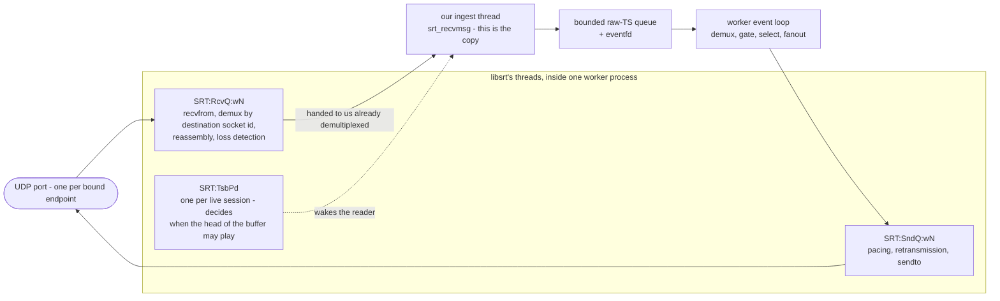
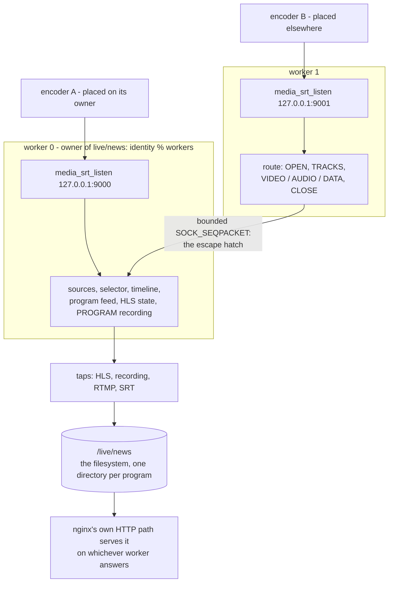
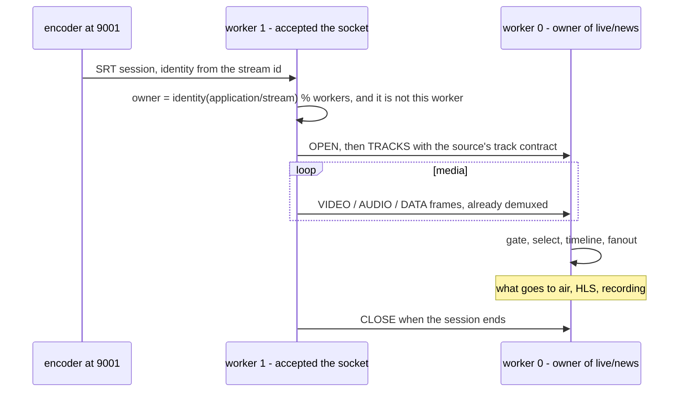
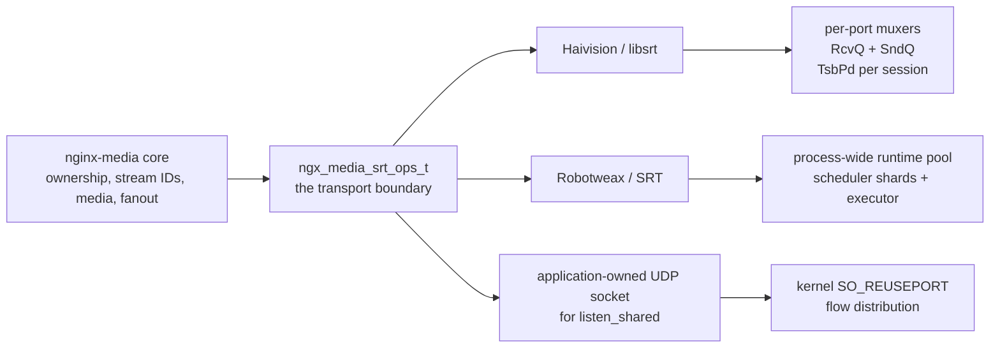

# Architecture

`nginx-media` is an NGINX module that turns redundant live, file and HLS inputs
into one logical program and distributes it over SRT, RTMP, HLS and recording.
This document is the map: what the pieces are, which thread owns what, and where
the boundaries are that keep the design honest.

The invariant everything else follows from:

```
INPUTS                 SOURCES                    SELECTOR            PROGRAM
SRT / bonded SRT       identity -> probe ->       priority +          timeline-normalized
RTMP / file / HLS      health -> eligibility      hysteresis          logical stream
                                                  + switch policy
                                                                          |
                                        +---------------+-----------+-----+------+
                                        |               |           |            |
                                      HLS          recording      RTMP          SRT
```

A **logical stream** is not a publisher.  One logical stream has many
**sources**: two encoders publishing the same program are two sources, a file
slate is another, a pulled HLS stream is another, and SRT bonding is redundancy
*inside* one source.  The selector picks one source at a time; every switch
increments `stream->generation`.

## Modules

| Directory | What lives there |
|---|---|
| `src/core/` | the program model: buffers, frames, tracks, timeline, sources, streams, destinations, the registry, health, compatibility, selection, policy, owner hashing, IPC, routing, the program feed and the runtime tick; also the file source and the HLS ingest, pull and push backends |
| `src/mpegts/` | MPEG-TS: CRC, demux (PSI, PES, PCR, continuity), mux, and the raw-TS ingest queue |
| `src/codec/` | NAL iteration/classification (H.264, H.265) and AAC framing |
| `src/srt/` | the transport contract, its backends, ingest, output destinations and the SRT module |
| `src/rtmp/` | RTMP wire protocol, FLV adapter and the RTMP module |
| `src/hls/` | the segmenter |
| `src/record/` | the recording writer (RAW, ISO, PROGRAM taps) |
| `src/api/` | the HTTP control API, and the `media_hls_ingest` upload endpoint |

`config` in the repository root is the module build description: it lists the
sources, the SRT backend selection and the libraries, and it is what
`--add-module` reads.

## Threads

NGINX workers own media state.  The threads the module creates exist only where
a blocking call would otherwise stall an event loop, and most of them hand work
back to a worker through an eventfd rather than touching worker state directly:

| Thread | Created by | Talks to the worker through |
|---|---|---|
| SRT ingest | `ngx_media_srt_ingest.c` | a bounded raw-TS queue plus an eventfd |
| SRT egress shards (16 stable lanes, adaptive active senders) | `ngx_media_srt_output.c` | a bounded shard-feed queue and per-destination queues |
| Recording writer | `ngx_media_record.c` | a work queue |
| HLS ingest reader (one per ingest source) | `ngx_media_hls_ingest.c` | publishes frames through the stream's publish path |
| HLS pull reader (one per pull source) | `ngx_media_hls_pull.c` | publishes frames through the stream's publish path |
| HLS push upload pool (four-thread ceiling, adaptive active count) | `ngx_media_hls_push.c` | a bounded per-destination queue |

The two HTTP readers are the exception to the eventfd rule: they demux on their
own thread and publish through the stream's own publish path — the same gate a
publisher's frames enter — because the alternative would be to hand raw
segments back and demux them twice.  The push pool is the mirror image of
the SRT senders: one shared pool serves every destination, and each destination
has its own bounded queue.  Active sender concurrency changes under the worker's
shared CPU budget; a stalled remote can occupy a pool thread until its deadline,
but cannot block the program or overflow another destination's queue.

Each output registers with the worker-local egress manager.  Its destination
record carries the application and stream incarnation, protocol, engine,
placement, representation ID and epoch, and feed ID and epoch alongside
per-destination delivery, drop, error, and queue telemetry.  The manager samples
worker CPU capacity and event-loop lag, then adapts SRT and HLS sender
concurrency under one budget that reserves one CPU for the event loop; SRT
retransmissions alone are not growth pressure.  The manager never migrates a
destination between workers, and RTMP sockets remain on their owning event
loop.

RTMP, the file source and the HTTP control API run entirely inside worker event
loops: a file source advances from the runtime tick, never from a thread of its
own.  Every thread is joined on the paths that stop it, including reload and
shutdown: a reader is stopped and joined before the source it publishes into is
torn down, and the recording writer is started and stopped repeatedly with work
queued and in flight, under ThreadSanitizer.

### The library's own threads

The SRT transport is libsrt, and libsrt runs threads of its own inside every
worker process.  They are not created or joined by this module.  They are also
where a publisher's bytes are actually received: data does not arrive on the
ingest thread, it arrives on a thread libsrt owns and is handed to us already
demultiplexed through `srt_recvmsg`.

| Thread | One per | What it does |
|---|---|---|
| `SRT:GC` | process | started by `srt_startup()`; reaps broken and closed sockets |
| `SRT:RcvQ:wN` | bound UDP port | reads the UDP socket, demultiplexes each packet to its session by destination socket id, and runs the whole per-packet receive path |
| `SRT:SndQ:wN` | bound UDP port | packs data packets at their pacing time, retransmits, and writes the UDP socket |
| `SRT:TsbPd` | live session | decides when the head of a session's receive buffer is old enough to play; spawned lazily by the first data packet |



The unit is the **port**, not the socket.  `srt_bind()` installs a multiplexer —
one UDP socket, one receive queue, one send queue — and every session accepted
on that port is served by that same pair of threads; a second socket bound to
the same port in the same process shares them, which is what
`CUDTUnited::updateMux` (`srtcore/api.cpp`) looks for.  The exception is a bind
that hands the library a socket it did not open (`srt_bind_acquire`), which
always builds a new multiplexer.  An outgoing connection is autobound to its
own ephemeral port, so it gets a muxer of its own and therefore a receive *and*
a send queue thread of its own (`CUDTUnited::connectIn`).

That places the work like this.  The socket read, the demultiplexing of a
packet to its session, reassembly, loss detection and the receive buffer all
run on `SRT:RcvQ:wN` — `CRcvQueue::worker` calls `worker_ProcessAddressedPacket`,
which looks the destination socket id up in the queue's hash and calls
`CUDT::processData`.  Pacing, retransmission and the UDP writes run on
`SRT:SndQ:wN`; control packets are the exception and go out on whichever thread
generated them, which is how an ACK is sent from the receive thread.  The
play-time decision for timestamp-based delivery runs on the session's
`SRT:TsbPd` thread.  What runs on **our** thread is the copy: `srt_recvmsg`
moves a packet out of the session's receive buffer and `srt_sendmsg` moves one
into the send buffer.  Our ingest thread reads data libsrt has already
received, demultiplexed and buffered; it never touches the UDP socket.

`SRT:RcvQ` is single-threaded per bound port, and that is the shape of the
scaling limit: one SRT listening port cannot use more than one core for
receiving and per-session packet processing, however many nginx workers are
configured or publishers connected to it.  `operations.md` has the measured
thread budget and the options that bound throughput.

## Ownership

A logical program has **one owner worker**, and the choice is deterministic:
`FNV-1a64(application/stream) % worker_count`, computed identically by every
worker with nothing to negotiate.  Ownership is therefore a property of the
program's identity and the configuration, not of the request that created the
program or of the worker that accepted its publisher, and the two functions
that ask about it — the one that drives (`ngx_media_route_is_owner`, asked by
the tick) and the one that reports (`ngx_media_route_owner`, asked by the API)
— answer from the same computation.  The owner holds the mutable state:
sources, selector, timeline, program feed, HLS state and program recording.

Shared memory holds only small metadata — the owner's slot, pid, the state it
is in, its generation, frame count and source count, and a heartbeat, plus the
one revision sequence the control plane mutates — never mutable media state and
never the decision itself.  The record is what the owner publishes about a
program it is running: a read on another worker uses it for the progress
figures, and a record whose owner has stopped heartbeating for ten seconds is
reclaimable by the next claim on that slot.  Transport socket
ownership may differ from program ownership, and where it can, it does: each
worker accepts on its own ingest endpoint, so a publisher is normally carried
by the worker that accepted it, and a publisher that lands on a non-owner
worker is routed to the owner over a bounded internal transport (Unix
`SOCK_SEQPACKET` by default).  That routing is the escape hatch, for routing
only, not a second data path — which is why the ingest endpoints are per
worker rather than one shared endpoint that would make routing the rule.



The worker that accepts a misplaced publisher does **not** register the source
at all: it opens the stream on its owner, then demuxes and forwards frames.  So
the gate, the selector, the timeline and the fanout all run where the program
lives, and the accepting worker's job is transport, demux and routing.



What travels on that transport is exactly two things, and both are one-way:
one stream's session and media to its owner (`OPEN`, `TRACKS`, `VIDEO`,
`AUDIO`, `DATA`, `CLOSE`), and the shape of the graph to every worker
(`GRAPH`).  Control needs no message of its own — a selection change is a
mutation of the graph and travels as one — and a routed source's owner learns
the source ended from its session's `CLOSE` rather than from a health or EOF
message.  Types 7, 8 and 9 are reserved in `ngx_media_ipc.h` and sent by
neither side.

### The graph is replicated, the program is not

One owner per program does not answer the control API's question, which is
"what is the graph": an operator's request can land on any worker, and a worker
that has never heard of a stream cannot answer a read or accept a source for
it.  So every accepted mutation — a stream, a source, the source's desired state
— is broadcast to the other workers over the same transport and applied to
their registries.  Each worker holds a replica of the graph, and any worker can
answer any read.

A replica is not a second program.  Only the owner materialises a transport —
opens the file, watches the directory, pulls the origin — and only the owner
runs selection, the program feed and the outputs, so a program reads a file
once rather than once per worker, and one program's egress is never split.  A
read that lands on a replica reports the graph, plus the generation and
program-frame figures the owner published in the shared directory — with
`owner` naming the slot the hash selects and `observed_here` false when that is
not this worker — and when the owner is not publishing at all those figures
read zero rather than being filled in from a copy that is not driving anything.
The transport and fanout figures in the same document are the answering
worker's own, so on a worker that does not drive the program they say nothing.
A **destination** is an output rather than graph state and is not replicated:
it is started where the program runs, so creating, deleting or applying one
through a document is answered by the stream's owner — anywhere else the
request is refused with `not_owner`, naming the owner, instead of starting a
sender that is never handed media.  The two operations that act on the running
program, a manual switch and a switchback, are refused the same way.

Operations carry the revision the API assigned to the mutation, and a replica
applies one only when the stream has not already moved past it, so an operation
that raced another worker's change to the same stream is a no-op rather than a
duplicate or a torn object.  A deletion is an operation like any other — it is
broadcast to every worker, and deleting a stream this worker does not have still
tells the workers that do — and each worker remembers the deletions it has seen
for a bounded window (a ring of 256 `hash`/`revision` pairs; the names are not
kept, because they would grow with churn), so an operation that was in flight
when the stream was deleted cannot create it again afterwards.  An operation
older than the window is the same best-effort case as an operation a worker
never received — which is why the window is a ring and not a history.
Without that memory a replica that had applied the delete would find no stream
when the older operation arrived and build one, and the deployment would hold a
stream the operator removed while its peers do not.  The control plane is still
bounded rather than consensus: a worker that is gone or behind is counted in
`nginx_media_graph_undelivered_total`, logged, and its encoded graph operations
are retained in a 256-entry repair journal.  Four entries per runtime tick are
retried over the non-blocking route until all currently connected peers accept
them.  A journal overflow or a worker/master replacement remains a controller
replay case, and replay is safe because every create is idempotent.

### Deleting a stream releases its memory

Each stream carries its own pool, and deleting one gives that memory back
rather than leaving it in the cycle pool until the worker exits — a controller
that creates and deletes programs does not grow the worker without bound.  What
makes that safe is ordered teardown, because a stream is not only referenced by
the registry:

- the runtime's per-stream state (output slots, the player preparation, the
  routed slots that publish into the stream) is released first, while the
  program feed is still there for the outputs to flush from;
- a file reader is paced by the tick on the worker's own thread, so it is
  closed in place: unlinked, its descriptor released, its source detached;
- a reader that owns a thread — an origin being pulled, a directory being
  watched — is told its source is gone and leaves on its own, and the pool it
  points at waits on the draining list until the tick has reaped it.  Freeing
  it in the delete instead would hand that thread a pointer into freed memory,
  and joining it in the delete would put an origin's latency on the control
  API's critical path;
- a push destination's uploader runs with the destination list lock released
  and can be inside an upload that takes as long as the remote takes, so the
  destination owns its own pool and a reference for every holder — the last one
  out frees it.

`nginx_media_streams_draining` is the gauge for the second case: a deleted
stream whose memory is still held by a reader that is stopping.  It returns to
zero on its own within a tick or two, and a reader that never stops is logged
with the counts holding it.

The log an object keeps is part of the same rule: a stream, a reader, or the
pool behind them outlives the request that created it, so what they keep is the
worker's log, never a connection's, which dies with the connection.

## The runtime graph

What a deployment declares in configuration is small; what it runs is a graph.
A **stream** is the program, and it owns two lists of runtime objects: its
**sources** and its **destinations**.  Stream, source and destination all have a
stable id and are created and addressed at runtime through the control API, not
written into `nginx.conf`, which is what lets a source be added while the
program is live and removed without a reload.

The graph is desired state.  A controller keeps a document of what the graph
should be and applies it; every create in the document is idempotent, so
applying it again changes nothing, and the API can hand the current graph back
in the shape it accepts.  That is what stands in for a database: the graph
survives a controller restart because the controller keeps the document and the
server re-applies it, not because the server stored a desired state it does not
enforce.  A stream absent from the document is not deleted — pruning is the
controller's decision, made with the delete calls, not a side effect of a
replay.

Each object carries a revision, taken from one sequence shared by every worker
— the counter in the shared owner directory — by every mutation of it or of a
child, and a mutation that states the revision it last saw is refused when it is
stale rather than overwriting a newer desired state.  One sequence rather than a
counter per worker is what makes two workers' operations comparable: a mutation
accepted by worker 0 and one accepted by worker 1 at the same moment get
different numbers, so every replica resolves the pair the same way — the higher
revision is the newer state and the lower one is dropped — instead of each
worker keeping whichever operation reached it last, which is how replicas
disagree.  Deletion does not require the object to exist: the caller asked for
an end state and that end state holds, which is what makes a retry after a
timeout safe.

Destinations are the same kind of object as sources, reached through the same
`ngx_media_destination_ops_t` contract the SRT transport uses: the core owns the
model and the list, and a backend registers itself once and is called for every
destination of the types it handles.  A destination type with no backend is
accepted by the API and then fails to start, which is honest about what the
build can carry.

## Data flow

Ingest (SRT): libsrt's receive-queue thread reads the UDP socket and
demultiplexes each packet to its session; the transport thread accepts, reads a
stream id, pushes raw TS into a bounded queue; the worker parses the stream id
into an identity, registers the source, drains the queue, demuxes TS into
frames, and feeds the source gate.

Selection: health is layered evidence (transport up, data flowing, container
valid, timestamps advancing, media valid, tracks compatible, source eligible) —
never a blended score.  A source is eligible or it is not; the winner is the
highest configured priority among eligible sources, and priority comes from
operator configuration, never from an encoder-supplied stream id field.

Program: the timeline maps the selected source onto program timestamps by
composition offset, preserving `pts - dts`, and every switch bumps the
generation so downstream taps can resynchronize on a keyframe.

Output: the program is prepared once (TS multiplex for SRT/record taps, FLV for
RTMP, fragmented MPEG-TS for HLS) and each destination consumes its own bounded
queue.  A slow destination is dropped from, never allowed to stall the program.

RTMP connections remain on the NGINX worker event loop. A worker-local
run queue visits runnable publishers under destination, media-unit, byte, and
service-time budgets; a socket-blocked output returns on write readiness.

### Where the other inputs and outputs sit

Everything that reads or writes a file sits at the edge of the program, on the
publishing side of the source gate or the consuming side of the fanout:

- A `file` source reads one bounded chunk of an MPEG-TS file per runtime tick,
  demuxes it and publishes the frames through the same source gate a publisher
  feeds.  Pacing is the tick and never a sleep, so a large file cannot stall a
  worker, and a slow file is simply a source that is not producing yet.
- An `hls_pull` source fetches a playlist and its segments over HTTP or HTTPS
  on its own thread, demuxes them and publishes them the same way.
- An uploaded segment arrives through the `media_hls_ingest` endpoint: nginx
  writes the body to a temp file and the handler renames it into the ingest
  directory, so a reader sees a whole segment or none of it.  A reader of type
  `hls_push` then demuxes it like any other source.  The writer and the reader
  are separate halves on purpose — the ingest endpoint does not know what reads
  the directory.  An HLS input is MPEG-TS carrying H.264 or H.265 video and/or
  AAC audio; a container with none of those yields no tracks and no frames, and
  the reader reports that once instead of producing a source that never goes on
  air for no stated reason.
- An `hls_push` destination receives notifications from the segmenter after a
  program's HLS segment or playlist has been atomically renamed.  It opens the
  sealed inode and queues that snapshot for upload; it does not scan the output
  directory.  With `media_hls <root>`, notifications match
  `<root>/<application>/<name>`, so programs do not share a playlist or segment
  namespace.  The HLS origin remains the local output directory and is separate
  from this push path.

Because all of these publish through the source gate or consume from the
fanout, selection, health and compatibility need to know nothing about where
the bytes came from, and nothing here can change what goes to air: the HLS
output is prepared from the program feed on the runtime tick, strictly
downstream of selection.

## Failure behaviour

- A source that stops producing fails on `failure_timeout` and the selector
  moves on; switching back is governed by `switchback` (`auto`, `manual`,
  `never`) and `recovery_timeout`.  A `file` source that reaches the end of its
  file stops producing and fails the same way, so a one-shot slate hands over
  like a publisher that went away.
- A destination that cannot keep up loses units from its own queue and counts
  them; the program is unaffected.  An HLS queue overflow drops the oldest
  queued file.  An opened inode remains readable after HLS retention unlinks or
  replaces its path.  Deleting a destination discards queued files; any upload
  already in flight retains its references until it finishes or times out.
- Recording I/O never runs on the event loop, and reload closes the current
  recording part cleanly instead of transferring a live descriptor.
- Nothing in the media path allocates per packet or blocks a worker.

## HLS push at fanout: does the copy path show up?

`tests/bench/hls_push_fanout.sh` runs two builds of the same code with one
function changed - the uploader's body transfer - against 8 destinations
receiving the same segments, and reports worker CPU per uploaded segment,
which is where a copy shows up.

| Uploader | Uploads | CPU per upload |
|---|---|---|
| `sendfile` | 48 | 0.3908 s |
| `fread` / `write` | 40 | 0.4702 s |

**About 17% less CPU per upload with sendfile**, and more uploads completed
over the same media.  `sendfile` is not a server-side privilege: it works on
any socket, including the client connection an upload uses, so the page cache
hands its pages straight to the socket and an upload costs one kernel-side
copy per destination instead of two.

Two honest caveats.  The upload counts differ between runs because the
directory scan is timing-dependent, so this is indicative rather than a
controlled A/B; and total worker CPU was nearly identical (18.76 s vs 18.81 s)
because the media pipeline - ingest, demux, mux - dominates, so the upload
copy is a small slice of the whole.  The saving is real and it is the right
default; it is not where the time goes.

## Serving HLS at fanout: what the measurements say

`make bench-hls-fanout` answers the question the sequential bench cannot:
many concurrent readers over a realistic sliding window (40 segments, 20 MiB,
32 concurrent clients, 4 rounds, best of three passes, with the server's
access log used to prove every request actually arrived).

| Variant | Throughput | Requests/s |
|---|---|---|
| disk, `sendfile` off | 3077 MiB/s | 6154 |
| disk, `sendfile on` + `tcp_nopush` | 2759 MiB/s | 5517 |
| tmpfs, `sendfile on` | 2857 MiB/s | 5714 |
| tmpfs, HTTPS with kTLS | 1127 MiB/s | 2254 |

- **Still no advantage from a memory filesystem**, and none from `sendfile`,
  even at 32 concurrent readers over a working set.  The differences are
  within run-to-run noise; the disk and tmpfs variants are the same speed.
- **TLS costs more at fanout than it does single-stream**: about 63% here
  against 38% sequentially, because the crypto is CPU-bound and concurrency
  multiplies that against a fixed core count.
- **The honest limit of this measurement**: it is loopback.  `sendfile`'s real
  value is avoiding the kernel-user copy on the way to a NIC, and loopback has
  no NIC to skip.  A deployment serving over a real interface should expect
  `sendfile` to matter more than this bench can show; what this bench *does*
  establish is that it never costs anything, and that tmpfs is not the lever.

## Serving HLS: what the measurements say

`make bench-hls` serves the same segment many times over each candidate
configuration.  On this machine (400 requests of a 3.3 MiB segment):

| Variant | Throughput | Per request |
|---|---|---|
| disk, `sendfile` off | 690 MiB/s | 4.69 ms |
| disk, `sendfile on` + `tcp_nopush` | 686 MiB/s | 4.71 ms |
| tmpfs, `sendfile on` | 678 MiB/s | 4.77 ms |
| tmpfs, HTTPS with kTLS | 429 MiB/s | 7.55 ms |
| disk, cold page cache | 648 MiB/s | 4.99 ms |

- **A memory filesystem does not help.**  Segments served from disk come out
  of the page cache at the same speed; tmpfs measured *slower* here, within
  noise.  It is not worth the operational cost of a RAM-backed directory that
  fills up and disappears on reboot.
- **`sendfile` is free but not decisive** for this working set: the segments
  are cached, so it is within noise of read+write.  It costs nothing and helps
  when the cache is cold or the files are larger, so enable it — just do not
  expect it to be the lever.
- **TLS is the lever.**  It costs about 38% against plain HTTP even with kTLS,
  because the crypto runs in software and this NIC has no offload.  kTLS still
  buys about 9% over userspace OpenSSL, and needs the `tls` kernel module
  loaded (`modprobe tls`) — without it nginx silently falls back and the cost
  is higher.

## Transport backends

The SRT transport is a contract (`ngx_media_srt_ops_t` in
`src/srt/ngx_media_srt_transport.h`), not a library call.  The media core and
the ingest/output modules see the contract; they do not see `SRTSOCKET`,
`CUDT`, Robotweax handles, or either library's private C++ types.



### What our code asks the backend to do

| Adapter surface | What the module owns | What the backend owns |
|---|---|---|
| `listen`, `listen_bond`, `listen_shared` | endpoint policy and retry | socket binding, listener state, group admission, or acquired-socket attachment |
| `poll_create`, `poll_add_*`, `poll_wait` | the ingest event loop | readiness and transport progress |
| `accept`, `accept_ready`, `streamid`, `recv` | the ingest thread and caller buffers | handshake, UDP receive, packet demultiplexing, reassembly, loss handling and receive buffering |
| `connect`, `send`, `stats` | destination queues and the fixed egress shard pool | connect, pacing, retransmission, UDP writes and transport statistics |
| `session_shutdown`, `session_close` | ordered thread teardown | waking blocked operations and releasing transport state |
| `library_version`, `last_error`, `shutdown` | startup logging and lifecycle | implementation identity, diagnostics and backend-global cleanup |

The adapter deliberately does not parse Stream IDs, register sources, mutate
logical streams, select a program, prepare output formats, or fan out media.
`streamid()` only supplies the identity to the module; ownership is then
`identity(application/stream) % workers`, and a non-owner session is routed by the
core IPC layer.  `recv()` supplies bytes into a caller-owned buffer and
`send()` accepts already-prepared transport bytes.  These boundaries are the
reason both libraries can qualify against the same module code.

The source-level path is intentionally visible:

- `src/srt/ngx_media_srt_module.c` parses `media_srt_*` directives, selects
  per-worker endpoints and starts/stops the worker-side transport.
- `src/srt/ngx_media_srt_transport.c` is the small forwarding layer.  It
  dispatches through the selected `ngx_media_srt_ops_t` table and turns an
  absent optional operation into a normal capability failure.
- `src/srt/ngx_media_srt_haivision.c` owns the `SRTSOCKET` wrappers and the
  SRT C-API implementation of the table.  The filename is historical: the
  same adapter can link against Haivision/libsrt or Robotweax/SRT; it does not
  use Haivision private internals.
- `src/srt/ngx_media_srt_ingest.c` and `ngx_media_srt_ingest.h` own the
  bounded per-worker session state, one shared transport poll, Stream ID
  extraction and the ingest thread.  A full session table refuses a new
  session rather than growing the scheduler.
- `src/srt/ngx_media_srt_output.c` and `ngx_media_srt_output_queue.*` own
  bounded per-destination queues and 16 stable logical egress shards.  A
  destination's slot maps to its logical shard modulo 16; the adaptive physical
  sender pool maps those logical lanes across its current active worker count,
  so scaling does not move a destination to a different shard.  Each lane
  services its slots and calls only `connect`, `send`, `stats`,
  `session_shutdown` and `session_close`.
- `src/srt/ngx_media_srt_udp.c` is a plain-UDP conformance double.  It is not a
  third SRT runtime and must not be used to infer reliability, encryption,
  pacing, group or library-thread behavior.

The runtime counts above exclude module-owned threads.  Each worker's SRT
destinations share 16 logical lanes and a 16-thread physical ceiling; active
sender concurrency adapts under the worker-local egress manager and shares the
available sender budget with HLS push after reserving one CPU for the event
loop.  Adding runtime destinations does not create threads.  A destination
queue is bounded at 256 units / 8 MiB, and each logical shard's feed queue at
64 units / 8 MiB.  The ingest thread, bounded session table and IPC/event-loop
work are also nginx-media resources.  Robotweax bounds the library transport
cost, not the complete worker's thread or queue budget.

`listen_shared` is an adapter capability, not an automatic property of every
SRT library.  The module creates the native UDP socket, sets `SO_REUSEPORT`,
binds it, and hands it to the backend through `srt_bind_acquire()` when the
selected backend exposes that path.  The kernel can then distribute
non-bonded flows across nginx processes; the SRT runtime still remains
process-local.  A backend that cannot acquire an application-owned socket
returns no shared-listener operation, and the directive must not be
approximated silently.

### Haivision/libsrt runtime

Haivision's `CUDTUnited` and its muxer registry are process-local.  A bound UDP
port gets one multiplexer containing:

```text
one bound port
    ├── SRT:RcvQ       UDP read, packet demux, reassembly, loss handling
    └── SRT:SndQ       pacing, retransmission, UDP write

each live session
    └── SRT:TsbPd      timestamp play-time decision
```

Every accepted session on that port shares the port's receive and send queue
threads.  An outgoing destination is autobound to an ephemeral port and gets
its own pair.  Consequently, adding endpoints gives more receive lanes, but
adding publishers to one endpoint does not.  The cost is a growing thread
count: one pair per bound port or destination and one timestamp thread per
live session.

The group registry is also process-local.  A bonded caller's legs must reach
one nginx worker so the same `CUDTUnited` can join them.  Separate nginx
workers cannot form one mirror group merely because their UDP sockets share an
address.

### Robotweax/SRT runtime

Robotweax is an independent SRT implementation behind the same C API.  Its
installed architecture contract schedules protocol work by connection
affinity, so one logical connection's state machine is not mutated
concurrently.  It uses a bounded, process-wide execution model rather than a
permanent waiting thread for every socket.

The qualified Robotweax 0.2.4 runtime measured in `/opt/robotweax` has:

```text
one nginx worker process
└── one Robotweax runtime
    ├── scheduler shard 0
    ├── scheduler shard 1
    ├── executor worker 0..3
    └── lazy close worker
```

That is seven runtime threads with one listener and with two listeners.  Work
for a channel is assigned to a scheduler shard by a round-robin counter.  One
port's receive path is therefore still serialized on one scheduler thread,
while all ports and destinations in that process share the fixed pool.  The
pool size is not an nginx directive or a public Robotweax scaling API.

Robotweax supplies connection groups and `srt_accept_bond()`.  Its group
contract can form a domain from multiple listeners **in the same process**;
listeners that are not in that domain remain isolated.  This helps a bonded
caller use multiple local interfaces within one worker, but it is not
cross-process group state.  All legs of a bond still have to reach one nginx
worker in this architecture.

The installed Robotweax library exports `srt_bind_acquire()` as well as the
group APIs, so it has the public pieces needed for the module's acquired-socket
path.  That proves API availability, not every deployment property: the
complete `media_srt_listen_shared` path remains an integration qualification,
and the runtime itself has no internal reuseport-equivalent.

### Scaling comparison and limits

| Question | Haivision/libsrt | Robotweax/SRT |
|---|---|---|
| Receive unit | one `RcvQ` per bound port | one scheduler shard per channel assignment |
| One port | one receive thread | one scheduler thread |
| More ports in one worker | adds queue threads and receive lanes | shares the fixed pool; at most the measured scheduler parallelism |
| More sessions | adds per-session `TsbPd` threads | shares the pool; no permanent thread per session |
| More destinations | adds an `RcvQ`/`SndQ` pair per destination | shares the pool |
| More nginx workers | independent process-local runtimes | independent process-local runtimes |
| Bonding | build-dependent, same-process group registry | built-in groups, same-process group domain |
| Shared port | application-owned socket plus kernel `SO_REUSEPORT` when supported | same acquired-socket requirement; no internal reuseport pool |

Neither backend turns one SRT port into an unlimited parallel receive path.
Haivision offers more parallelism as endpoints are added, at the cost of
threads.  Robotweax keeps thread count bounded, but ports contend for its
fixed scheduler pool and can reach that ceiling sooner.  Adding nginx workers
adds independent process-local runtime instances in either case; it does not
merge their session or group registries.

The production consequences are:

- Use one endpoint per worker for predictable ingest placement.
- Point every source of one logical program at the program owner's endpoint.
- Keep every leg of one bonded caller in one worker; `media_srt_listen_shared`
  is not a bonding mode.
- Treat the IPC route as a correction path for a misplaced publisher, not as a
  way to create more receive capacity.
- Treat shared-port membership changes as a session-failure risk: the kernel
  can re-hash flows, while neither runtime can migrate session state between
  nginx processes.
- Size module queues, library buffers, scheduler capacity and worker count
  separately; a lower Robotweax thread count is not proof of higher media
  throughput.

The detailed measured thread names, buffer defaults, discard points, shared
port behavior and Robotweax limitations are in `operations.md`.  The backend
selection and qualification commands are in `configuration.md`.  The UDP
implementation in this repository is only a conformance test double; it is
not a third production SRT runtime.
