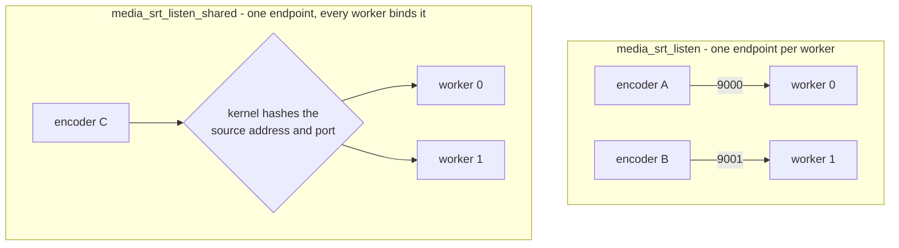

# Operations

Running a deployment: what to watch, what failure looks like from outside, what
a reload does to the runtime graph, what the system bounds, and what it
deliberately does not do.  `configuration.md` is the directive reference and
`api.md` is the route reference, including the full list of emitted series;
this document is about what to do with them.

Every number below is a constant in the code or an assertion in a test script,
and the file it comes from is named where it matters.  The test scripts under
`tests/integration/` are the authority on what actually happens under load and
failure, so where a behaviour is asserted there, the script is cited rather
than the design.

## The three surfaces

- `GET /media/api/v1/metrics` is Prometheus text, maintained by the runtime and
  computed nowhere on the request path (one registry walk per scrape).  The
  series and their meaning are listed in `api.md`.
- The rest of `/media/api/v1/` is the graph: streams, sources, destinations,
  the desired-state document.  A scrape and a control call are different jobs:
  the metrics endpoint is for looking, the rest is for changing.
- The error log.  The operational lines are `NOTICE` and `WARN`, so the log has
  to be set to `info` (`error_log ... info;`) rather than left at nginx's
  default `error`, or they are suppressed.  A switch, a destination's
  reconnect, an ingest session that had no free slot and the SRT backend that
  actually answered are all `NOTICE`/`WARN` lines and nothing else reports them.

Metrics are answered by whichever worker accepts the connection, and they
describe that worker: its registry, its tick, its output slots.  The series
carry no worker identity, so a multi-worker deployment needs the scrape
configuration to supply an external label per worker; a scrape that lands on one
worker behind a load balancer is watching a fraction of the deployment and will
look healthy while another worker is late.  With `worker_processes 1`, which is
what the graph tests use, this is moot.

## What to watch

### Fanout delay is the capacity metric

`nginx_media_stream_fanout_delay_ms` is the age of a unit of media when a
consumer finally takes it.  The reported number is the upper bound of the
histogram bucket the percentile falls in, and the buckets are powers of two in
milliseconds, so the value is always a power of two and the true delay is
somewhere between half of it and it: `1` means under two milliseconds, `64`
means 32 to 63.  An idle program reports `1`.

The histogram is cumulative for the life of the stream, not a rolling window:
it is not reset by anything short of deleting and recreating the stream (or a
reload, which loses the graph), so `max` is a lifetime record and a bad minute
early in the stream's life keeps showing up in `p99`.  Compare ranges across
streams of the same age, or watch the rate of change, rather than reading a
single scrape as the current state.

What a bad reading looks like: `p50` that does not sit at `1` on a machine with
nothing else running; `p99` in the tens or hundreds and rising; `max` climbing
without a corresponding event (one switch, one publisher connect).  The `p99`
and `max` move before `p50` does, and `p50` above a few milliseconds means the
typical unit of media is delivered late, which is a program that is already
behind rather than about to be.

`nginx_media_stream_dispatched_total` is the count of units consumers have
taken.  Its rate falling toward zero while `nginx_media_stream_program_frames`
still grows is the one unambiguous reading in this group: media is being
produced and nobody is taking it.  Both series exist per stream, so alert per
stream rather than on their sum.

### Worker event-loop delay is the first symptom

The runtime tick runs every 100 ms
(`NGX_MEDIA_RUNTIME_INTERVAL`, `src/core/ngx_media_runtime.h`) and the timer is
re-armed *after* the tick returns, so the cadence is the tick's own duration
plus the interval.  `nginx_media_worker_event_loop_delay_ms` is the gap between
the last two ticks, and anything above 100 is time the worker could not get
back to its timer.  `nginx_media_worker_late_ticks_total` counts ticks whose gap
exceeded 150 ms (the interval plus half).  `nginx_media_worker_service_ms` and
`nginx_media_worker_max_service_ms` are how long the tick itself took: the time
this worker spent serving every program it owns.

Everything periodic happens on that tick — file sources advance by one chunk,
the HLS push scan offers new segments, each stream drains its output slots (HLS
segmenting, recording) and prepares its transport bursts — so this is the
leading indicator for all of it.  A `service_ms` of 80 ms is not "80% of a
budget": it makes the effective cadence 180 ms, and the program feed backlog
grows at the difference.  A `delay_ms` that stays above the interval, or
`late_ticks_total` incrementing at all on an otherwise idle machine, is the
first thing to look at; by the time fanout delay has moved, the worker has
already been late for a while.

### The feed backlog is the slack being spent

`nginx_media_stream_feed_units` and `nginx_media_stream_feed_bytes` are the
media the program feed still retains: units published but not evicted.  The
ceilings are 2048 units, 32 MiB and 10 seconds of age (`NGX_MEDIA_API_FEED_*` in
`src/api/ngx_media_api_module.c`, and the same three numbers on the SRT, RTMP
and routed paths), and eviction happens only when a publish would exceed one of
them — not when consumers catch up.  The window therefore grows to whatever the
ceilings allow and stays there.

In steady state the age ceiling trims first: roughly ten seconds of frames, for
a typical live rate well under the unit and byte ceilings.  A high-bitrate
program reaches 32 MiB sooner, and that is the ceiling that matters for it.  A
reading pinned at or near a ceiling means more than ten seconds of media has
been published inside the window, which is another way of saying a consumer is
behind it.  When a publish does evict, the oldest unit goes whether or not any
consumer took it; a consumer whose position is behind the retained tail is
overrun and resumes at the next keyframe, which is a discontinuity in the HLS
output and a gap in a recording, not an error anywhere.

### Sources on air

`nginx_media_source_active` is the cheapest alert in the set: summed per stream,
zero means nothing is on air.  `nginx_media_source_healthy` going to `0` is a
source that is attached but failing; `nginx_media_source_frames_in` that stops
advancing while the transport is up is a source that is connected and silent,
which fails after `media_failover_failure_timeout` like any other failure.
`nginx_media_source_frames_out` is what reached the program, so a standby source
with `frames_in` advancing and `frames_out` flat is one that is cached and ready
— that is the shape of healthy redundancy, not of a problem.

`nginx_media_reconnecting_sources` is worker-wide and counts sources whose
transport is up but which are not carrying media yet (state `awaiting_sync`).  It
is the honest measure of how much of the configured redundancy is actually
available right now: two publishers configured and one reconnecting means one
switch of headroom, not two.

`nginx_media_stream_switches` is a counter, so alert on its rate rather than its
value; `nginx_media_stream_generation` increments with every switch and is what
downstream consumers see as a discontinuity.  Emergency switches are *not* in
the metrics — `emergency_switches` is only in the stream detail JSON — so a
deployment that needs to know it is down to an incompatible source must poll
the detail route.

`nginx_media_runtime_outputs` is the number of per-stream output slots in use,
bounded at 16 per worker (`NGX_MEDIA_RUNTIME_MAX_OUTPUTS`).  A slot is taken on
the tick for every owned stream that has an output configured, whether or not
that stream is carrying media, so the table caps how many streams one worker can
serve with HLS or recording at 16.  A count that does not fall after streams are
deleted means ordered teardown is leaking one;
`tests/integration/api_graph_nginx.sh` asserts it returns to 2 or fewer after ten
create/delete cycles.

## Failure modes from outside

### A source goes unhealthy

Health is layered evidence, not a score: transport up, data flowing, container
valid, timestamps advancing, media valid, tracks compatible
(`src/core/ngx_media_health.h`).  A closed transport is hard evidence and fails
the source immediately; a silent or frozen one fails after
`failure_timeout` (1500 ms default); a source that was failed becomes eligible
again only after `recovery_timeout` (10 s default) of continuous good evidence.

From outside: `nginx_media_source_healthy` drops to `0`, `frames_in` stops
advancing, and the stream detail's `evidence` bitmask names the layer that is
unhappy (`0x01` transport up through `0x20` tracks compatible) rather than
leaving an operator to guess.  `compat` goes `unknown` before the source has
declared tracks.  The selector then moves on its own and logs
`media: selector switched stream=... active=... generation=... switches=...` at
`NOTICE`; `switches` and `generation` both increment and every consumer sees the
discontinuity.  A `file` source that reaches the end of its file stops producing
and fails the same way, so a slate hands over like a publisher that went away.

`tests/integration/failover_nginx.sh` is the worked case: a killed publisher, a
`SIGSTOP`ed one (frozen timestamps), and a replacement publishing garbage
(container and media layers), each failing over and each recovering through the
normal path.  `tests/integration/fault_nginx.sh` does the same while asserting
the worker stays up and keeps writing HLS.

### A switch

A switch is not an error and needs no intervention: the selector takes the
highest-priority eligible source, the timeline composes the new source onto the
program's clock, and with `media_failover_switch_keyframe` on (the default) the
change lands at the incoming source's next keyframe so the program stays
decodable.  What an operator sees afterwards is `generation` incremented, a
`#EXT-X-DISCONTINUITY` in the HLS playlist at the boundary, SRT and RTMP
destinations resuming at the next sync boundary, and a player that has a reason
to reconnect.

`switchback` decides whether the recovered higher-priority source takes the
program back: `auto` (default) does it after `recovery_timeout` of good
evidence, `manual` waits for `POST .../switchback`, `never` does not return.  The
per-stream timeouts can be changed on a live stream with `PATCH`, which is the
route to take when one program is flapping and the rest of the fleet is fine.

### An emergency switch

When the only eligible source left is incompatible with the program, the
selector promotes it anyway rather than going dark, increments
`emergency_switches`, and bumps the generation so every consumer resynchronizes.
The program's shape changes — that is what incompatible means: a program track
with no counterpart, or a different codec — so devices that were decoding may
stop, and the switch is deliberate rather than accidental.

The only place this is visible is the stream detail JSON (`emergency_switches`,
and `compat: incompatible` on the source).  The log line is the same
`media: selector switched` line an ordinary switch produces, so an operator who
only reads logs cannot tell the two apart; alert on the JSON field if it
matters.

### A stalled HLS remote

An `hls_push` destination uploads on a shared pool of four threads, and each
destination has its own 64-entry queue
(`NGX_MEDIA_HLS_PUSH_QUEUE`/`_POOL`, `src/core/ngx_media_hls_push.c`).  When a
remote stalls, the queue fills and the oldest queued segment is dropped and
counted, rather than anything waiting on it; the program is unaffected, which
`tests/integration/hls_push_nginx.sh` asserts directly by stalling the sink and
checking that `program_frames` keeps advancing.

From outside there is very little to see, and that is the honest state of it: the
remote's directory stops growing, and nothing else changes.  The destination
keeps reporting `enabled`, the program's own metrics are healthy, and there is
no log line for a failed or dropped upload and no metric for it either — the
counters exist in the process (`ngx_media_hls_push_uploaded_total` and its
`dropped`/`failed` siblings) and are not published by the API or the metrics
endpoint.  The practical monitor is the remote: compare what it has received
against the HLS directory's playlist, and treat a stalled remote as a
destination to delete and recreate rather than something the server will report.

A destination pointed at a directory `media_hls` does not write simply receives
nothing, since the scan only ever offers the configured HLS directory
(`configuration.md`).

There is a ceiling worth knowing about on long-running destinations: each one
remembers the 256 most recent file names it has offered
(`NGX_MEDIA_HLS_PUSH_SCAN_MAX`).  That list never shrinks, so after 256 distinct
segment names — about 25 minutes at the default 6 s target — a new name cannot be
recorded as seen and is offered again on every scan, which is roughly ten times a
second.  The symptom is the same file arriving repeatedly at the remote and the
destination's internal drop counter climbing; the program is still unaffected.

### A slow SRT or RTMP receiver

An SRT sender has its own thread and a queue of 256 units / 8 MiB per
destination (`src/srt/ngx_media_srt_output.c`).  On overrun it drops whole bursts
and resumes at the next sync boundary, so a receiver that cannot keep up loses
media and never stalls the program.  RTMP is the same shape with a 128-message
per-destination queue and a one-second reconnect backoff.

This one *is* reported: the sender thread hands status changes back through an
eventfd and the worker logs them, so a slow receiver shows up as
`media: srt output <n> not connected (attempts=... dropped=...)` at `WARN`, and
the `NOTICE` line when it reconnects carries the cumulative drop count.  `<n>` is
a slot in the destination table, not the destination id, so correlate it with
`media: srt destination <id> started for app/stream -> host:port`, which is
logged when the destination starts.  RTMP destinations log their own connect
failures (`media: rtmp destination <id> could not connect to ...`).

Both transports are bounded by slots, and running out is a create that fails
rather than a silently dead destination: SRT has 8 destination slots per worker
shared by `media_srt_output` and runtime destinations, and a create when they
are full returns `500 {"error":"destination_start_failed"}` and leaves no object
behind.  SRT ingest is 16 concurrent sessions per worker and RTMP is 32 per
worker, so the ceiling an instance offers is that number times the worker count
(128 RTMP sessions at four workers); a publisher over the limit is refused by
the worker that accepted it, which is the worker the kernel placed it on, with
`media: no free ingest session slot` and `media: rtmp: no free session slot` in
the log.

### A worker that has stopped owning a program

Only the owner drives a program: the tick skips streams whose ownership hash is
not this worker's, so in a worker that has lost ownership of a stream nothing
runs — no selection, no outputs, no log line.  Ownership is deterministic
(FNV-1a over `application/stream`, modulo the worker count) and never moves
during a worker's life, so this is not a thing that drifts; it is a thing that
is wrong from the start or that stops being right when the worker count changes.

The shared owner directory (`src/core/ngx_media_owner_dir.c`, 256 slots in the
master's mapping) holds only bookkeeping — owner slot, pid, generation, state,
timestamp — and is used as a routing hint: a live record wins over the
deterministic slot, and a record whose timestamp is more than ten seconds old,
or whose pid is this worker's from an earlier generation, is reclaimable by the
next claim.  A claim happens when a stream is created, which is the API path, a
publisher attaching on its owner worker, or a routed publisher's `OPEN`.

From outside, a stream that is inert in the worker holding it looks like this in
the detail JSON: `active` unchanged or `none`, `program_frames` frozen, no
`dispatched` growth, no HLS writes, and worker metrics that are perfectly
healthy because the worker has nothing to do.  The fix is on the operator's
side: the graph is worker state, so put the stream where it is owned — see the
multi-worker note under reconciling.

## Routine operations

### Reload

`nginx -s reload` reads the configuration and starts new workers; the old ones
drain and exit.  Every runtime object is worker memory — streams, sources,
destinations, the program feed, HLS state, the recording writers — so **a reload
loses the graph**.  The new worker starts with an empty registry and the
configuration it was given; the API has nothing to hand back.
`tests/integration/api_graph_nginx.sh` asserts exactly that: send `HUP`, wait for
`media: srt listener ready`, read `/media/api/v1/streams`, and the stream is
gone.  Media being carried at that moment stops with it: the old workers stop
their ingest and exit, so a publisher's session ends when they do; recordings are
closed cleanly rather than transferred, so the current part is complete.

What survives a reload is the configuration and the shared owner directory,
which lives in the master's mapping; records written by the previous worker
generation are reclaimable under the ten-second rule above.  Nothing else does.

What a reload is good for is exactly this: it is how a directive change takes
effect.  What it is not is a way to keep a graph alive — that is the
desired-state document's job, applied after the new workers are up.

`tests/integration/soak_nginx.sh` is the load case for it: two reloads in the
middle of publisher churn, with the assertions that no worker dies across the
reload, no core dump appears, RSS growth stays under 64 MiB, and the HLS playlist
and program recording are still being written at the end.

### Restart

The same, without the drain: the process starts empty.  Nothing is restored,
because nothing was ever stored — the server holds the graph, it does not
persist a desired state it then enforces.  A restart is therefore: start the
process, wait for the listener-ready line, apply the document you keep, then
delete anything the document does not mention.

### Reconciling

The contract is in `api.md`; the operational shape of it is:

1. `GET /media/api/v1/desired` is what the server actually has, in the shape
   `PUT` accepts.
2. `PUT` the document the controller keeps.  Every create is idempotent, so
   replaying a document against a live worker creates nothing
   (`"children_created":0`) and changes no existing child.
3. `DELETE` what should not exist.  The server never prunes — a stream absent
   from the document is left alone — so this step is the controller's decision
   and not a side effect of applying.

A mutation may carry the revision it last saw and is refused with
`409 stale_revision` when it is stale, which is the signal that someone else
wrote; a delete of something already gone succeeds, which is what makes a retry
after a timeout safe.

Three things about a document are worth knowing before writing a controller
against it.  It is capped at 8192 bytes — an API for a graph of tens of streams,
not thousands — and a larger body is `400 body_too_large`.  A document creates
sources as labels: the readers that `POST .../sources` opens for `file`,
`hls_pull` and `hls_push` are not opened from a document, so those three are
created with the route and then round-trip through `GET`/`PUT` like anything
else.  And the document does not carry `enabled`: a source disabled out of band
stays disabled through a replay, which is intended (enable and disable are
desired state) but surprises a controller that expects the document to win.

One limit that bites during a reconcile: the API starts whatever destinations
the document names, and a destination is materialised by the program's owner.
On a worker that does not own a program the document is refused with
`409 destination_needs_owner` rather than accepted and silently ignored.

## How many workers, and what they buy

The graph is replicated and the program is not.  Every worker holds a copy of
every stream, its sources and its destinations, so any worker can answer any
read and apply any mutation.  Exactly one worker owns each program, and that
worker runs the tick which drives selection, fanout and outputs - so a source
that carries its own reader, a file or an origin or a directory, is opened only
there and not once per worker.

That distinction is what the worker count buys, and it is not "more throughput
per stream":

- **More programs, not more fanout.** One program's fanout is done by its
  owner, so that cost does not spread over workers at all. Adding workers adds
  room for more programs.
- **Ownership follows the worker that created the program.** The graph is
  replicated, but who owns what is decided when the program is created, so the
  spread of programs over workers follows the spread of the requests that
  created them.
- **One listening endpoint is one receive thread.** The receive and
  per-session demultiplexing are done by the library, on a thread it owns per
  bound port, so the worker count does not divide that cost — the endpoint
  count does.  The section after this one has the library's runtime, the
  threads it creates per unit, and the options that bound throughput.

`make bench-worker-scaling` reports the first of those, and
`make bench-ingest-egress` the second: eight programs created over four
workers landed on two of them.  That is not our bug and nginx says so itself -
its accept code notes that with `EPOLLEXCLUSIVE` "most of the connections are
handled by the first worker process", which is why it re-adds the listening
socket periodically.  Its answer is `reuseport`, and measured on the same
listener the eight programs spread across all four workers.  Put it on any
listener nginx creates:

```nginx
server {
    listen 8080 reuseport;
    ...
}
```

Which mechanism applies depends on the protocol, because it depends on who owns
the socket:

| listener | protocol | how connections are spread |
|---|---|---|
| control API, HLS | TCP, nginx's socket | `listen ... reuseport`; the kernel hashes each connection and there is no accept mutex |
| RTMP ingest | TCP, this module's socket | `SO_REUSEPORT` on the socket, one listener per worker |
| SRT ingest | UDP, libsrt's socket | one listening endpoint per worker: libsrt exposes no reuseport of its own, so the endpoint is what is spread, and `media_srt_listen` is given once per worker (worker i binds the i-th entry).  A single entry puts every publisher on worker 0.  Or one endpoint shared by every worker (`media_srt_listen_shared`), where `SO_REUSEPORT` on a socket each worker owns is what spreads them - see "One shared SRT port" below for what that costs |

An SRT publisher is placed, not hashed: it connects to an endpoint, so the
worker that accepts it is the worker whose entry it was given.  Placing it on
the worker that owns its program is therefore an operator's choice - the owner
is deterministic (`hash % workers`) and the graph reports it as `owner`, so
which entry to point an encoder at is a lookup rather than a guess - and a
publisher placed elsewhere is routed to the owner over the internal transport
as before.  With one entry there is no placement to make and every publisher
arrives at worker 0, which is what a single-worker deployment and an existing
configuration already do.



A **bonded** caller can only use the first shape, and the second is refused
beside `media_srt_listen_bond` rather than warned about: the legs of one group
have different source addresses by construction, so the kernel hashes them to
different workers, and libsrt joins a caller's legs through a registry that is
process state.  A bond that silently became two independent publishers would be
a correctness failure, not a degradation.

The **master is not in any of this**.  It creates the listening socket before
forking so every worker inherits the same descriptor, then forks, respawns and
reloads; it never accepts a connection and never distributes one.  For nginx's
own TCP listeners the kernel does the distributing — `EPOLLEXCLUSIVE` wakes one
waiting worker, or the accept mutex decides which worker accepts next — which is
why an unqualified listener spreads poorly without `reuseport` and why the
kernel's hash is what spreads a `reuseport` one.  For SRT there is nothing to
distribute with: the socket belongs to libsrt, one multiplexer per bound port,
and its receive queue demultiplexes by destination socket id.  Distribution
there is configuration, not scheduling.  A *shared* port is the exception to all of this: the
kernel hashes each publisher onto a worker, and the operator places nothing -
see "One shared SRT port" below for what that trades away.

### One shared SRT port, and what it costs

The port-per-worker mode above is one way.  There is another - one endpoint for
the whole instance, `media_srt_listen_shared` - and an earlier version of this
document got it badly wrong: it said libsrt could not share a port between
processes.  It can, and the public API for it is in the header and exported
from the shipped library:

```c
SRT_API int srt_bind_acquire(SRTSOCKET u, UDPSOCKET sys_udp_sock);
```

The application creates the UDP socket itself, sets `SO_REUSEPORT` on it, and
hands it to libsrt: that is exactly what every worker does for
`media_srt_listen_shared`.  No patch to libsrt, no vendored build, no BPF
program - and the mode is not the default, because of what is measured below.
(For the record, a patch to libsrt *was* written during the investigation,
before `srt_bind_acquire` turned out to be public API: it is kept unapplied as
`scripts/srt-reuseport.patch`, since a library that exposes the socket is a
better answer than a fork of it.)

**Measured** with four processes on one port and eight publishers: the
sessions distribute across the processes, and every session's bytes arrive at
exactly one of them - no gaps, no loss, no retransmits, no session ever split.
The kernel's own hashing is sufficient, and it is worth saying why a BPF
program of the kind nginx uses for QUIC is not only unnecessary but would be
**wrong** here: the destination socket id is zero in a caller's first packets
and only becomes the listener-chosen id afterwards, whereas the source address
and port never change for the life of a session.  The address is the stable
identity for SRT; the socket id is not.

The same shape measured through nginx (`make srt-shared-port`): four workers
on one endpoint and eight publishers, all eight accepted by three or four of
the workers rather than one, every one of them reaching its program's owner,
and seven or eight of the eight - those the kernel put on a worker that does
not own the program - routed over the internal transport.  The distribution is
a hash, so it is uneven and it is not round-robin: the session ceiling is still
16 per worker, and a run of publishers can fill one worker's slots while
another has none.  When that happens it is that worker's log that says
`media: no free ingest session slot`.

**What it costs is membership.**  `SO_REUSEPORT` re-hashes a flow when the set
of sockets bound to the port changes, and a flow re-hashed onto a process that
has no session state for it dies.  Measured in the mode itself, four workers
and eight publishers carrying media, one `nginx -s reload`: **all eight
failed**, within two seconds of the signal, each encoder reporting a failed
submit.  Nothing survived, and nothing reconnects by itself.

The same measurement on a `media_srt_listen` endpoint - one endpoint per
worker - ends the live publisher's session too: a session is worker state and
the generation a reload replaces exits.  So on a reload the two modes are
equivalent.  What is unique to the shared port is a change in the bound set
that is *not* a reload: a worker respawned after a crash joins the group and
re-hashes every flow in flight, so publishers on workers that changed nothing
die with it, where the per-worker mode would have lost only the crashed
worker's own port and its own sessions.  The microbenchmarks behind that, four
processes on one port: adding a listener to a port with six live sessions
killed four of them instantly, and the exit of a listener that held *no*
session killed six of six, permanently.

So the constraint is: **the set of processes bound to the port must not change
while publishers are connected.**  That is a property of sharing a port between
processes with long-lived flows, not something to engineer around.  It is why
the port-per-worker mode is the default and this one is asked for by name:

```nginx
media_srt_listen_shared 0.0.0.0:9000;
```

It cannot be combined with `media_srt_listen` (one entry per worker is a
different mode) or with `media_srt_listen_bond` (see below); either is a
configuration error naming the reason.  The instance logs the reload
constraint once per configuration read, before any worker starts, so an
operator who enabled the mode without reading this page still sees what it
does.  Changing the directive *into* the shared mode on a reload is handled:
the old generation holds the port without `SO_REUSEPORT`, the new workers log
`is not available yet ...; retrying until the port is free`, and all of them
take the port over once the old generation exits - measured, four workers
binding the one endpoint and a publisher accepted afterwards.

Placement survives a reload - the new generation binds the same endpoints and
retries until the old generation releases them.  A shared port retries too, but
there is nothing left to preserve: the sessions it was carrying are gone.

**A shared port also cannot carry a bonded caller**, and this is the harder
constraint of the two.  libsrt builds the receiving side of a bond as a
"mirror group": `CUDT::makeMePeerOf()` in `srtcore/core.cpp` looks it up with

```c
CUDTGroup* gp = uglobal().findPeerGroup_LOCKED(peergroup);
```

and `uglobal()` is process-global state.  Legs that arrive in the same
process find that group and join it; legs that arrive in different processes
each find nothing and each create their **own** mirror group, so the caller's
bond is silently split into N single-leg groups.

That is not awkward, it is incompatible.  Bonding exists so that a stream
survives a path failing, which means the legs have *different source
addresses* by construction - and a shared port hashes each leg independently
on exactly that, so the legs scatter across workers on their own.  The
port-per-worker mode has no such problem: a bonded caller sends every leg to
the same destination address, so they all reach one process and one mirror
group, which is what `srt_accept_bond` over that process's listening sockets
expects.

So a deployment that bonds must use one endpoint per worker, and the shared
mode is for deployments that do not.  The shared listener does not enable group
acceptance at all (`SRTO_GROUPCONNECT` is left off, and `interpretGroup()`
rejects a group handshake when it is off), so a bonded caller pointed at a
shared port is *refused*, visibly, rather than quietly split into independent
publishers; and `media_srt_listen_bond` beside `media_srt_listen_shared` is a
configuration error naming this reason.  `media_srt_listen_shared` in
docs/configuration.md is where the directive itself is written down.

Measured against a shared listener with four workers, a two-leg broadcast
caller: the caller side reports

```
SRT.cn: HS EXT: agent is a group member, but the listener did not respond
with group ID. Rejecting.
```

and `srt_connect_group()` fails, so the publisher fails and says why.  The
listener is left with one session that carried nothing -
`srt source close session=1 bytes=0 chunks=0`, no source and no program frames
- which is the whole of what a bond gets from a shared port.  The refusal is
not visible in nginx's own log: it happens in the caller's handshake, so the
side that complains is the encoder.

## The library's runtime: threads, buffers, and what bounds throughput

Everything above is this module's own threads and queues.  The SRT transport is
a library, and libsrt runs a runtime of its own inside every worker process:
threads that read and write the UDP socket, buffers that hold media before we
ever see it, and options that decide how much of it may be in flight.  None of
that appears in `nginx.conf` — the directives configure the module, not the
library — so what a deployment runs is the library's defaults unless something
sets them otherwise.  This section is what those are, what we set, and what
they mean for sizing.  `architecture.md` has the same threads from the
structural side.

### The threads, and the unit each is per

Read from `/proc/<worker-pid>/task/*/comm` while a worker carries media; the
names are libsrt's own.

| Thread | Appears when | One per | What it does |
|---|---|---|---|
| `SRT:GC` | `srt_startup()`, so with the first listener or destination | worker process | reaps broken and closed sockets |
| `SRT:RcvQ:wN` | a socket is bound to a port — `srt_bind()`, or the autobind inside `srt_connect()` | bound UDP port | reads the UDP socket, demultiplexes each packet to its session by destination socket id, and runs the whole per-packet receive path |
| `SRT:SndQ:wN` | same | bound UDP port | packs data packets at their pacing time, retransmits, and writes the UDP socket |
| `SRT:TsbPd` | the first data packet of a session in timestamp mode | live session | decides when the head of that session's receive buffer is old enough to play |

The unit is the port, not the socket, and two things follow from that.

**Receive is single-threaded per port.**  Every session accepted on one
listening endpoint is served by one `SRT:RcvQ` thread: the socket read, the
demultiplex by destination socket id, reassembly, loss detection and the
receive buffer all happen there.  A worker with one `media_srt_listen` endpoint
and sixteen publishers has one thread doing all of their receive work, and
adding workers does not add receive capacity to that port — adding endpoints
does.  That is the same conclusion the endpoint table above reaches for
placement, arrived at from the other side: a worker given its own port is given
its own receive thread with it.

**Every destination costs two more.**  An outgoing connection is autobound to
its own ephemeral port, so it gets a multiplexer of its own: an `SRT:RcvQ` to
receive the peer's acknowledgements and loss reports, and an `SRT:SndQ` to pace
and transmit.  A worker at full occupancy — one listening endpoint, sixteen
publishers, eight SRT destinations — is therefore one `SRT:GC`, one
`SRT:RcvQ`/`SRT:SndQ` pair for the listener, sixteen `SRT:TsbPd`, sixteen more
library threads for the destinations, plus this module's own ingest thread and
its eight sender threads: 44 threads.  The eight-destination ceiling is what
bounds it, and it bounds it per worker.

### Which side does what

The receive queue does the receiving.  `CRcvQueue::worker` reads the socket and
calls `worker_ProcessAddressedPacket`, which looks the packet's destination
socket id up in the queue's hash and calls `CUDT::processData` on the session
that owns it — so by the time `srt_recvmsg` returns, the packet has already been
received, demultiplexed, reassembled and buffered.  Our ingest thread takes it
out of the receive buffer and pushes it into the raw-TS queue.  Symmetrically,
`srt_sendmsg` copies into the session's send buffer, and that session's
`SRT:SndQ` thread does the pacing, the retransmission and the UDP writes.

This is worth measuring once rather than assuming.  With a publisher streaming
to a listener and the application *not* reading for two seconds, only the
`SRT:RcvQ` thread accumulated CPU time; the application thread and `SRT:TsbPd`
did nothing.  Draining the socket for the next three seconds split the CPU
three ways — the application thread and `SRT:RcvQ` at roughly equal cost, and
`SRT:TsbPd` at most of the remainder.  Receive and demultiplexing are the
library's; the copy out of its buffer is ours.  (Loopback, one session, this
machine: the split is indicative, not a benchmark.)  The `SRT:TsbPd` thread
copies nothing either — it decides when a packet may play and wakes the reader,
and the copy happens in `srt_recvmsg` on our thread.

### The options that bound throughput

The module sets no SRT socket option in `src/srt/ngx_media_srt_module.c` at
all; that file is configuration, registration and the worker-side event
handler.  Every option is set in the transport adapter,
`src/srt/ngx_media_srt_haivision.c`, and there are few of them.  What follows
is the whole picture for the options that bound throughput.

| Option | What it bounds | We set | Library default |
|---|---|---|---|
| `SRTO_TRANSTYPE` | the whole profile: timestamp mode, 120 ms latency, repeated loss reports, message API | `SRTT_LIVE` on the listener, on an accepted session and on a destination | live is the built-in default |
| `SRTO_UDP_RCVBUF` | the kernel receive buffer of the port's UDP socket — **shared by every session on that port** | nothing | 8192 × MSS = 12,288,000 bytes requested, then clamped by the kernel |
| `SRTO_UDP_SNDBUF` | the kernel send buffer of the port's UDP socket | nothing | 65,536 bytes requested |
| `SRTO_RCVBUF` | one session's receive buffer: the last hop before our ingest queue | nothing | 8192 packets = 12,058,624 bytes |
| `SRTO_SNDBUF` | one destination's send buffer: media accepted from us and not yet acknowledged | 4 MiB per SRT destination | 8192 packets = 12,058,624 bytes |
| `SRTO_FC` | packets in flight, the flow-control window; a loss holds the window open until it is recovered or dropped | nothing | 25,600 packets, ≈33 MiB at the 1316-byte payload |
| `SRTO_MAXBW` | the send rate ceiling | nothing | −1, which in live mode means the 1 Gbps pacing ceiling |
| `SRTO_MAXREXMITBW` | the retransmission rate | nothing | −1 (unlimited) — and it is not in this library's headers at all: the build compiles it out unless it enables the 1.6 API preview |
| `SRTO_LATENCY` | the play-out buffer, the larger of the two sides' requests | nothing | 120 ms receive latency |
| `SRTO_TSBPDMODE` | whether packets are held to their timestamp before the application sees them | nothing | on in live mode |
| `SRTO_NAKREPORT` | whether a loss is reported again once the retransmission timeout expires | nothing | on in live mode |
| `SRTO_RCVSYN` | blocking or polling reads | 0 on a polled listener, 1 on an accepted session | true |
| `SRTO_RCVTIMEO` | how long a read blocks | 1000 ms on a listener, 200 ms on each session read | −1 (infinite) |
| `SRTO_SNDTIMEO` | how long a send blocks | 2000 ms, on a destination | −1 (infinite) |
| `SRTO_CONNTIMEO` | how long a connect attempt takes | 2000 ms, on a destination | 3000 ms |
| `SRTO_REUSEADDR` | whether a second bind may share the port inside the process | yes on a listener | true |
| `SRTO_GROUPCONNECT` | whether the listener accepts a group caller | 1 on a bonded listener only | 0 |

The ones not in the table are not set either: `SRTO_PAYLOADSIZE` (1316 bytes,
the seven-packet MPEG-TS aggregation, is the live default), `SRTO_MESSAGEAPI`,
`SRTO_TLPKTDROP` (on), `SRTO_PEERIDLETIMEO` (5000 ms), `SRTO_INPUTBW` and
`SRTO_OHEADBW` (consulted only when `SRTO_MAXBW` is 0, which it is not), and
`SRTO_LINGER` (off in live mode).

Three of them deserve a sentence more than a row.

**The UDP receive buffer is shared, and the kernel decides its size.**
`SRTO_UDP_RCVBUF` belongs to the port, so the 12 MiB the library asks for is
the burst budget of *every* publisher on that endpoint together, not of each of
them.  The library asks the kernel for it before the port exists, and the
kernel clamps the request to `net.core.rmem_max` and reports back double what
it granted.  On this machine `net.core.rmem_max` is 4 MiB, so a listener's UDP
receive buffer is 4 MiB — `ss -ulmpn` shows `rb8388608` for the port — rather
than the 12 MiB requested; a machine left at the common 212,992-byte default
would give it about 208 KiB, under a fifth of a second of one 8 Mbit publisher.
`net.core.rmem_max` and `net.core.wmem_max` are the lever, and they are the one
thing here that is not a socket option.

**`SRTO_FC` is the per-session throughput bound on a lossy path.**  It caps how
many packets may be unacknowledged, so a session on a link with round-trip time
R cannot exceed `FC × payload / R` — at the default 25,600 packets of 1316
bytes, about 2.7 Gbit/s at 100 ms and about 540 Mbit/s at 500 ms.  Nothing we
set changes it, and it is the option to raise for a long-haul or satellite
path.  It has to be raised before `SRTO_RCVBUF`, which may not exceed it.

**`SRTO_SNDBUF` is the one buffer we enlarge.**  Four mebibytes is roughly 3,000
packets a slow receiver can fall behind into before a send fails and the module
drops a burst and resumes at the next sync boundary.  It bounds the
destination, not the program: the module's own per-destination queue (256 units
/ 8 MiB) sits in front of it, and neither one stalls the tick.

### Where the library discards media

There are two places libsrt drops, and neither is a module counter.  When a
session's receive buffer is full — because our ingest thread has not drained it
yet, which is what a full raw-TS queue behind it means — the receive queue
drops the arriving packet and says so:

```
SRT:RcvQ:w1!W:SRT.qr: @<socket>: No room to store incoming packet seqno <n>,
    insert offset <m>. Space avail 0/8192 pkts.
```

When a packet arrives too late to be played inside the latency budget, the
timestamp thread drops it instead:

```
SRT:TsbPd!W:SRT.br: @<socket>: RCV-DROPPED <n> packet(s). Packet seqno %<m> delayed for 903.887 ms
```

Both mean the same thing from outside — media was lost inside the library,
before this module's continuity counters could see it — and both are error-log
lines, so they need `error_log ... info;` like every other operational line
here.  The totals are in the session's transport statistics (`pktRcvDropTotal`,
which the adapter reports as `packets_dropped_too_late`).

### robotweax: the same options, a different runtime

The alternative implementation is selected at build time (`configuration.md`)
and speaks the same C API, so the option table above does not change with it.
The defaults it reports are the same numbers: 12,058,624 for `SRTO_RCVBUF` and
`SRTO_SNDBUF`, 25,600 for `SRTO_FC`, 120 ms for the receive latency, −1 for
`SRTO_MAXBW`.  What changes is the runtime underneath.

It does not create a thread per port or per session.  Its transport runs on a
fixed, process-wide pool — two scheduler shards, a four-worker executor and a
lazily created close worker, seven threads in a worker process, independent of
how many listeners, publishers and destinations there are (measured: seven
threads with one listener bound, seven with two).  Channel work is assigned to
a shard by a round-robin counter, so one port's receive path is still
serialized on one thread, but the transport can use two cores in total however
many ports exist, where libsrt gives each port its own thread.  The pool size is
not an option or an API; there is no reuseport equivalent either.

The one thing it offers that the libsrt on this machine does not is connection
groups: robotweax compiles bonding in unconditionally, while the distribution
libsrt does not — `srt_create_group()` returns `SRT_INVALID_SOCK`,
`SRTO_GROUPCONNECT` is rejected as an unknown option, and that is exactly what
the module reports as "this SRT library was built without bonding".  So a
deployment that wants a bonded listener picks robotweax, or a libsrt built with
`-DENABLE_BONDING=ON`, for that reason and not for throughput.

Plainly: switching libraries changes no scaling property of this module's
ingest or egress.  The per-port single-threaded receive path is the same on
both, the options and their defaults are the same, and the thread count per
worker goes *down* rather than up — the library stops charging a thread pair
per bound port and per destination, and charges a fixed pool instead.  What it
buys is a different ceiling, not a higher one: fewer threads, and less receive
parallelism as ports are added.

## What is bounded, and by what

Everything that could grow without limit is bounded, and the bounds are
constants rather than configuration, so the way to tell a limit is being
approached is a reading, not a directive.

| What | Bound | Where it shows |
|---|---|---|
| Program feed backlog | 2048 units, 32 MiB, 10 s age per stream | `feed_units`, `feed_bytes`; eviction at a ceiling is a discontinuity downstream |
| Runtime output slots | 16 per worker, one per stream with an output configured | `nginx_media_runtime_outputs`; a count that does not fall is a leak, and 16 is the stream ceiling per worker |
| Standby GOP cache | 512 units / 4 MiB per source | `preroll_units`, `preroll_bytes`; `preroll_overflows` rising means the cache is being cleared instead of kept, so a switch has no cached GOP to land on |
| SRT destinations | 8 slots per worker | create fails `500 destination_start_failed` |
| SRT sender queue | 256 units / 8 MiB per destination | drop count in the `srt output` log lines |
| SRT ingest sessions | 16 per worker | `media: no free ingest session slot` |
| SRT ingest queue | 256 chunks / 8 MiB | new chunks dropped and counted; demuxer counts the continuity damage |
| SRT session receive buffer (library) | 8192 packets / 12,058,624 bytes per session | `No room to store incoming packet` in the error log; the packet is lost before our counters see it |
| SRT receive queue (library) | one thread per listening endpoint, shared by every session on it | the first thing that saturates as publishers are added to one port; no metric, only the log |
| SRT UDP receive buffer (kernel) | `net.core.rmem_max` per listening endpoint, shared by every session | `ss -ulmpn` shows `rb` for the port; overflow is silent and appears as loss and retransmission |
| SRT flow window (library) | 25,600 packets in flight per session | caps one session's throughput at `FC × payload / RTT` on a lossy path |
| SRT threads per worker (library) | 1 GC + 2 per bound port + 1 per live session + 2 per destination | `ps -L -o comm -p <worker-pid>`; 44 at one endpoint, sixteen publishers and eight destinations |
| RTMP sessions | 32 per worker, so 32 × workers in the instance | `media: rtmp: no free session slot` |
| RTMP destination queue | 128 messages | drops to the next sync boundary |
| HLS push queue | 64 entries per destination, pool of 4 | internal counters only; nothing published |
| HLS output window | 6 segments, 8 MiB per segment, 64 MiB retained | evicted segments are deleted from disk, so the directory does not grow |
| Recording queue | 1024 jobs / 32 MiB pending, parts roll at 512 MiB | drops counted internally; the part-rolled file is the visible artefact |
| Inter-worker routing | 256 queued messages, 4 MiB frame, 32 routed sources per worker | a routed publisher that cannot be forwarded is dropped to a sync boundary |
| API response and body | 64 KiB buffer, 8192-byte request body | a pathological registry produces a truncated error; a large document is `400` |

Disk is the one thing not bounded by the server: the HLS directory is trimmed by
the segmenter, but recording parts and the ingest directory are the operator's
responsibility.

## What the system deliberately does not do

- It does not store or enforce desired state.  A document is applied, not
  reconciled against, and the server never deletes what the document omits.
  The controller owns the truth; the graph lives in worker memory and does not
  survive a reload, a restart, or a worker process dying.
- It does not convert media.  The timeline composes a source onto the program's
  clock, preserving `pts - dts`; it does not transcode, rescale or re-encode, so
  a switch to an incompatible source is an emergency rather than a conversion.
- It does not authenticate the control API.  There is no key, token or plugin in
  the module: the API is exactly as protected as the location that serves it, and
  that is the operator's decision.
- It does not route the control plane between workers.  Routes act on the
  registry of the worker that accepts them.
- It does not produce one HLS output per program.  `media_hls` applies to every
  program and the segmenter writes `index.m3u8` and `seg-NNNNNN.ts` into the
  configured directory with no per-program subdirectory, so two programs carrying
  media at once share a playlist and a segment name space, including the eviction
  that deletes files.  The tests carry one program at a time; a deployment with
  several programs that need HLS output wants one directory per program.
- It does not let a profile configure the segmenter.  A `youtube_live`
  destination's validated `segment_duration_ms` and `playlist_window` are
  recorded on the destination and do not drive segmentation, which is fixed at a
  6 s target with a 6-segment window; the profile guarantees that the
  destination is one the platform would accept, nothing more.
- It does not publish a metric for destination-level drops.  SRT reports them in
  the log, HLS push reports them nowhere, and the emergency switch count is only
  in the detail JSON — all three named above where they are.
- It does not carry a `record` destination.  The type is accepted by the API and
  fails to start, because no backend is registered for it in this build;
  recording is the static taps (`media_record`, `media_record_raw`,
  `media_record_iso`) applied to every stream.
- It does not do per-publisher SRT encryption.  A listener carries one
  passphrase, because a stream id only becomes readable after the handshake
  completes; per-publisher secrets need one listener per publisher.
- It does not slow the program for a slow consumer, ever.  A destination that
  cannot keep up loses media that is counted, the feed evicts the oldest unit
  rather than waiting, and the recording writer drops jobs rather than blocking
  the tick.  That is the design, not a degradation under stress: the symptom of
  an overloaded deployment is lost media at the edges, never a stalled program.
