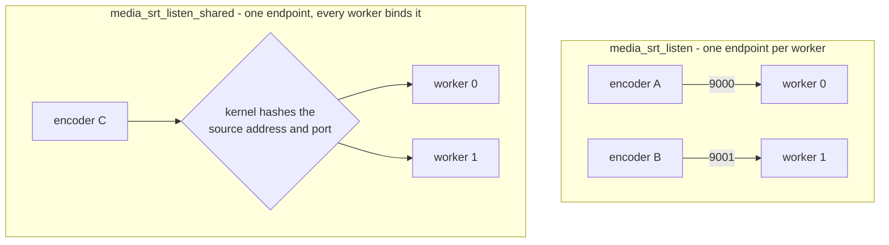

# Operations

Running a deployment: what to watch, what failure looks like from outside, what
a reload does to the runtime graph, what the system bounds, and what it
deliberately does not do.  `configuration.md` is the directive reference and
`api.md` is the route reference, including the full list of emitted series;
this document is about what to do with them.

Every number below is a constant in the code or an assertion in a test script,
and the file it comes from is named where it matters.  The test scripts under
`tests/integration/` are the authority on what actually happens under load and
failure, so where a behaviour is asserted there, the script is cited rather
than the design.

## The three surfaces

- `GET /media/api/v1/metrics` is Prometheus text, maintained by the runtime and
  computed nowhere on the request path (one registry walk per scrape).  The
  series and their meaning are listed in `api.md`.
- The rest of `/media/api/v1/` is the graph: streams, sources, destinations,
  the desired-state document.  A scrape and a control call are different jobs:
  the metrics endpoint is for looking, the rest is for changing.
- The error log.  The operational lines are `NOTICE` and `WARN`, so the log has
  to be set to `info` (`error_log ... info;`) rather than left at nginx's
  default `error`, or they are suppressed.  A switch, a destination's
  reconnect, an ingest session that had no free slot and the SRT backend that
  actually answered are all `NOTICE`/`WARN` lines and nothing else reports them.

Metrics are answered by whichever worker accepts the connection, and they
describe that worker: its registry, its tick, its output slots.  The series
carry no worker identity, so a multi-worker deployment needs the scrape
configuration to supply an external label per worker; a scrape that lands on one
worker behind a load balancer is watching a fraction of the deployment and will
look healthy while another worker is late.  With `worker_processes 1`, which is
what the graph tests use, this is moot.

## What to watch

### Fanout delay is the capacity metric

`nginx_media_stream_fanout_delay_ms` is the age of a unit of media when a
consumer finally takes it.  The reported number is the upper bound of the
histogram bucket the percentile falls in, and the buckets are powers of two in
milliseconds, so the value is always a power of two and the true delay is
somewhere between half of it and it: `1` means under two milliseconds, `64`
means 32 to 63.  An idle program reports `1`.

The histogram is cumulative for the life of the stream, not a rolling window:
it is not reset by anything short of deleting and recreating the stream (or a
reload, which loses the graph), so `max` is a lifetime record and a bad minute
early in the stream's life keeps showing up in `p99`.  Compare ranges across
streams of the same age, or watch the rate of change, rather than reading a
single scrape as the current state.

What a bad reading looks like: `p50` that does not sit at `1` on a machine with
nothing else running; `p99` in the tens or hundreds and rising; `max` climbing
without a corresponding event (one switch, one publisher connect).  The `p99`
and `max` move before `p50` does, and `p50` above a few milliseconds means the
typical unit of media is delivered late, which is a program that is already
behind rather than about to be.

`nginx_media_stream_dispatched_total` is the count of units consumers have
taken.  Its rate falling toward zero while `nginx_media_stream_program_frames`
still grows is the one unambiguous reading in this group: media is being
produced and nobody is taking it.  Both series exist per stream, so alert per
stream rather than on their sum.

### Worker event-loop delay is the first symptom

The runtime tick runs every 100 ms
(`NGX_MEDIA_RUNTIME_INTERVAL`, `src/core/ngx_media_runtime.h`) and the timer is
re-armed *after* the tick returns, so the cadence is the tick's own duration
plus the interval.  `nginx_media_worker_event_loop_delay_ms` is the gap between
the last two ticks, and anything above 100 is time the worker could not get
back to its timer.  `nginx_media_worker_late_ticks_total` counts ticks whose gap
exceeded 150 ms (the interval plus half).  `nginx_media_worker_service_ms` and
`nginx_media_worker_max_service_ms` are how long the tick itself took: the time
this worker spent serving every program it owns.

Everything periodic happens on that tick — file sources advance by one chunk,
each stream drains its output slots (HLS segmenting, recording), prepares its
transport bursts, and samples worker resources for egress adaptation.  HLS push
is not scanned here: the segmenter notifies destinations after atomically
renaming a sealed segment or playlist.  This is the leading indicator for the
worker-owned periodic work.  A `service_ms` of 80 ms is not "80% of a
budget": it makes the effective cadence 180 ms, and the program feed backlog
grows at the difference.  A `delay_ms` that stays above the interval, or
`late_ticks_total` incrementing at all on an otherwise idle machine, is the
first thing to look at; by the time fanout delay has moved, the worker has
already been late for a while.

### The feed backlog is the slack being spent

`nginx_media_stream_feed_units` and `nginx_media_stream_feed_bytes` are the
media the program feed still retains: units published but not evicted.  The
ceilings are 2048 units, 32 MiB and 10 seconds of age (`NGX_MEDIA_API_FEED_*` in
`src/api/ngx_media_api_module.c`, and the same three numbers on the SRT, RTMP
and routed paths), and eviction happens only when a publish would exceed one of
them — not when consumers catch up.  The window therefore grows to whatever the
ceilings allow and stays there.

In steady state the age ceiling trims first: roughly ten seconds of frames, for
a typical live rate well under the unit and byte ceilings.  A high-bitrate
program reaches 32 MiB sooner, and that is the ceiling that matters for it.  A
reading pinned at or near a ceiling means more than ten seconds of media has
been published inside the window, which is another way of saying a consumer is
behind it.  When a publish does evict, the oldest unit goes whether or not any
consumer took it; a consumer whose position is behind the retained tail is
overrun and resumes at the next keyframe, which is a discontinuity in the HLS
output and a gap in a recording, not an error anywhere.

### External profile transform

A stream with `"media":"profile"` is not transcoded in the NGINX worker.  The
owner launches the configured FFmpeg executable as a direct child, places it
in its own process group, and feeds bounded MPEG-TS bursts through
nonblocking pipes.  The current limits are eight queued bursts, 8 MiB of
queued input and 256 KiB of executor I/O per runtime tick.  A full input
journal drops the newest burst and logs `transform input journal is full`;
the worker never blocks waiting for FFmpeg.

The child is restarted after EOF or abnormal exit with 250 ms to 5 s
exponential backoff and a hard restart ceiling.  A restart increments the
executor epoch, resets the transformed demux/package cursor and emits an HLS
discontinuity; destinations remain attached to the same stream.  Watch
`media: transform executor started`, `restarted` and `failed` in the
`info`-level error log.  `media_transform_ffmpeg` is a direct executable path,
not a shell command, and the worker passes only structured arguments derived
from `media_transform_profile`.

Admission fails before graph activation when a stream requests `profile` but
no executor path is configured.  The profile adapter currently emits
H.264/AAC MPEG-TS.  The source representation remains the default and avoids
the executor entirely.

### Sources on air

`nginx_media_source_active` is the cheapest alert in the set: summed per stream,
zero means nothing is on air.  `nginx_media_source_healthy` going to `0` is a
source that is attached but failing; `nginx_media_source_frames_in` that stops
advancing while the transport is up is a source that is connected and silent,
which fails after `media_failover_failure_timeout` like any other failure.
`nginx_media_source_frames_out` is what reached the program, so a standby source
with `frames_in` advancing and `frames_out` flat is one that is cached and ready
— that is the shape of healthy redundancy, not of a problem.

`nginx_media_reconnecting_sources` is worker-wide and counts sources whose
transport is up but which are not carrying media yet (state `awaiting_sync`).  It
is the honest measure of how much of the configured redundancy is actually
available right now: two publishers configured and one reconnecting means one
switch of headroom, not two.

`nginx_media_stream_switches` is a counter, so alert on its rate rather than its
value; `nginx_media_stream_generation` increments with every switch and is what
downstream consumers see as a discontinuity.  Emergency switches are *not* in
the metrics — `emergency_switches` is only in the stream detail JSON — so a
deployment that needs to know it is down to an incompatible source must poll
the detail route.

`nginx_media_runtime_outputs` is the number of per-stream output slots in use,
bounded at 16 per worker (`NGX_MEDIA_RUNTIME_MAX_OUTPUTS`).  A slot is taken on
the tick for every owned stream that has an output configured, whether or not
that stream is carrying media, so the table caps how many streams one worker can
serve with HLS or recording at 16.  A count that does not fall after streams are
deleted means ordered teardown is leaking one;
`tests/integration/api_graph_nginx.sh` asserts it returns to 2 or fewer after ten
create/delete cycles.

`nginx_media_streams_draining` is the other half of the same question.  A stream
that owns a reader thread — a pull source, a directory being watched — is
deleted at once, but its memory waits for that reader to notice and leave, so
the pool is not freed under a thread that is still reading it.  The gauge is
that wait, in streams: it goes up when such a stream is deleted and back to zero
within a tick or two, and a value that stays up is a reader that has stopped
making progress.  The delete itself never waits: an origin that answers slowly
must not put its latency on the control API.  `make stream-delete` is the case
that holds all of this, including a delete while an upload is in flight against
a remote that never answers.

## Failure modes from outside

### An input carries nothing this build can read

An HLS input — a pulled playlist's segments, or segments uploaded to
`media_hls_ingest` — is expected to be MPEG-TS carrying H.264 or H.265 video
and/or AAC audio.  The demux reads the PMT, tracks those stream types and counts
the ones it does not recognise, so an origin or an uploader that sends, say,
MPEG-2 video in MPEG-TS produces no tracks and no frames.  The source then sits
as one whose transport is up and which is not carrying media yet — the same
state a publisher that has not sent a keyframe is in, and it is counted in
`nginx_media_reconnecting_sources` — and it never goes on air.

That is not silent: the reader logs one `WARN` naming the source and the stream
types it accepts, the first time a segment carries nothing usable.  The fix is on
the sending side (transcode to H.264/AAC, or point the source at an origin that
carries those); there is no configuration that makes this build carry MPEG-2,
AC-3 or subtitles.

### A source goes unhealthy

Health is layered evidence, not a score: transport up, data flowing, container
valid, timestamps advancing, media valid, tracks compatible
(`src/core/ngx_media_health.h`).  A closed transport is hard evidence and fails
the source immediately; a silent or frozen one fails after
`failure_timeout` (1500 ms default); a source that was failed becomes eligible
again only after `recovery_timeout` (10 s default) of continuous good evidence.

From outside: `nginx_media_source_healthy` drops to `0`, `frames_in` stops
advancing, and the stream detail's `evidence` bitmask names the layer that is
unhappy (`0x01` transport up through `0x20` tracks compatible) rather than
leaving an operator to guess.  `compat` goes `unknown` before the source has
declared tracks.  The selector then moves on its own and logs
`media: selector switched stream=... active=... generation=... switches=...` at
`NOTICE`; `switches` and `generation` both increment and every consumer sees the
discontinuity.  A `file` source that reaches the end of its file stops producing
and fails the same way, so a slate hands over like a publisher that went away.

`tests/integration/failover_nginx.sh` is the worked case: a killed publisher, a
`SIGSTOP`ed one (frozen timestamps), and a replacement publishing garbage
(container and media layers), each failing over and each recovering through the
normal path.  `tests/integration/fault_nginx.sh` does the same while asserting
the worker stays up and keeps writing HLS.

### A switch

A switch is not an error and needs no intervention: the selector takes the
highest-priority eligible source, the timeline composes the new source onto the
program's clock, and with `media_failover_switch_keyframe` on (the default) the
change lands at the incoming source's next keyframe so the program stays
decodable.  What an operator sees afterwards is `generation` incremented, a
`#EXT-X-DISCONTINUITY` in the HLS playlist at the boundary, SRT and RTMP
destinations resuming at the next sync boundary, and a player that has a reason
to reconnect.

`switchback` decides whether the recovered higher-priority source takes the
program back: `auto` (default) does it after `recovery_timeout` of good
evidence, `manual` waits for `POST .../switchback`, `never` does not return.  The
per-stream timeouts can be changed on a live stream with `PATCH`, which is the
route to take when one program is flapping and the rest of the fleet is fine.

### An emergency switch

When the only eligible source left is incompatible with the program, the
selector promotes it anyway rather than going dark, increments
`emergency_switches`, and bumps the generation so every consumer resynchronizes.
The program's shape changes — that is what incompatible means: a program track
with no counterpart, or a different codec — so devices that were decoding may
stop, and the switch is deliberate rather than accidental.

The only place this is visible is the stream detail JSON (`emergency_switches`,
and `compat: incompatible` on the source).  The log line is the same
`media: selector switched` line an ordinary switch produces, so an operator who
only reads logs cannot tell the two apart; alert on the JSON field if it
matters.

### A stalled HLS remote

An `hls_push` destination uploads sealed-file notifications on a shared pool
with a four-thread ceiling and a 64-file queue per destination
(`NGX_MEDIA_HLS_PUSH_QUEUE`/`_POOL`, `src/core/ngx_media_hls_push.c`).  There is
one upload in flight per destination; active sender concurrency starts at one
and adapts within the worker's shared CPU budget.  Queue overflow drops and
counts the oldest queued file instead of blocking the producer or another
destination.  `tests/integration/hls_push_nginx.sh` asserts that
`program_frames` keeps advancing while its sink is stalled.

The destination can remain `enabled` when its remote is unavailable, so inspect
the worker-local metrics at `/media/api/v1/metrics`.  Per-destination
`nginx_media_egress_delivered_bytes_total`,
`nginx_media_egress_dropped_units_total`,
`nginx_media_egress_transport_errors_total`,
`nginx_media_egress_backpressure_events_total`,
`nginx_media_egress_reconnects_total`, and
`nginx_media_egress_deadline_misses_total` are counters;
`nginx_media_egress_queue_bytes` and `nginx_media_egress_queue_lag_ms` are
gauges.  The worker resource series
`nginx_media_egress_available_cpu_milli`,
`nginx_media_egress_worker_cpu_permille`,
`nginx_media_egress_event_loop_lag_msec`,
`nginx_media_egress_active_workers`, and
`nginx_media_egress_engine_cpu_permille` show capacity and sender concurrency.
Engine CPU is measured for SRT/HLS sender pools; RTMP stays on its owning event
loop.  Scrapes are process-local, so monitor every NGINX worker.

Every outbound HTTP operation has a deadline: five seconds to connect to one
address, ten seconds without progress on a read or a write.  A remote that
accepts the connection and then says nothing occupies an upload thread until
that deadline; the pool ceiling bounds this cost. Queue pressure can grow the
active pool only while there is CPU headroom and space under the shared SRT/HLS
sender budget. HLS queue lag or bytes must rise across samples; a startup
backlog that is draining does not trigger expansion. New drop and backpressure
events remain pressure signals. Transport errors or SRT retransmissions alone
do not trigger growth. A stalled upload fails with a transport error rather
than publishing a truncated file.

A destination pointed at a directory no program writes to receives no files:
notifications match only the program's exact HLS output directory
(`<media_hls>/<application>/<name>`); there is no fallback directory scan
(`configuration.md`).  Each notification opens the sealed inode, so later
playlist rewrites or HLS retention unlinks do not change an already queued
snapshot.  Deleting a destination drops its queued files; an upload in flight
retains its references until it completes or reaches its deadline.

### A slow SRT or RTMP receiver

SRT destinations share 16 stable logical egress shards per worker; the manager
adapts active sender concurrency within the shared SRT/HLS worker CPU budget.
An output does not create a sender thread.  Static and runtime outputs share
1000 destination slots per worker.  Each destination has a bounded queue of
256 units / 8 MiB, and each logical shard has a 64-unit / 8 MiB feed queue.
Queue overrun drops bursts and resynchronizes at the next keyframe, so a slow
remote does not stall its program.  Queue occupancy and drops are available in
the shard and destination metrics.  SRT transport retransmissions are measured
but do not independently cause sender growth.  Connection state is reported
through the worker eventfd: `WARN` when an output is disconnected and `NOTICE`
when it connects.  The logged `<n>` is a destination-table slot, not the
destination ID; correlate it with `media: srt destination <id> started ...`.
RTMP connect failures are logged as
`media: rtmp destination <id> could not connect ...`.

RTMP destinations have a 128-message / 512 KiB per-destination queue and a
one-second reconnect backoff. Media is driven by one worker-local ready queue,
not a 40 ms timer per destination. New shared-FLV media wakes publishing
destinations; a bounded scheduler visit rotates among runnable outputs, and a
socket blocked on write is re-enqueued by its write-readiness event. Each visit
stops at 64 destinations, 512 media units, 8 MiB of media wire bytes, or 2 ms,
whichever limit comes first; per-destination batches shrink under worker CPU or
event-loop pressure. A shared maintenance heap handles protocol deadlines,
retries, and reports.
RTMP remains on its owning event loop; its destination table holds up to 1000
active outputs per worker.

Both destination tables reject creates at capacity: SRT returns
`500 {"error":"destination_start_failed"}` and leaves no object behind; the
RTMP destination allocator also refuses a create when its 1000 slots are full.
SRT ingest allows 16 concurrent sessions per worker and RTMP allows 1024, so
the per-instance session ceiling is that number times the worker count.  A
publisher over the limit is refused by the worker that accepted it, which is
the worker the kernel placed it on, with `media: no free ingest session slot`
or `media: rtmp: no free session slot` in the log.

### A program whose owner worker is not there

Only the owner drives a program: the tick asks the same deterministic question
for every stream — `FNV-1a64(application/stream) % worker_count == this
worker` — and a worker that is not the answer runs nothing for that stream: no
selection, no outputs, no HLS writes, no log line.  Ownership is the same
answer on every worker by construction (64-bit FNV-1a over
`application/stream`; a hash collision still maps two names to the same owner,
not to the same registry entry), so the worker that reports a program and the
worker that drives it cannot disagree, and nothing an operator sends through the
API can move it: which worker owns a program is a function of the program's name
and `worker_processes`.  The graph reports it as `owner`, the same value
everywhere.

The shared owner directory (`src/core/ngx_media_owner_dir.c`, 256 slots in the
master's mapping) is bookkeeping about that owner and never the decision: the
slot, its pid, the generation being served, the frame and source counts, the
state, and a heartbeat the tick refreshes.  A read on another worker answers
with those published figures, and a record whose owner has stopped heartbeating
for more than ten seconds is reclaimable, which is how a program whose worker
died gets a record again once the master has respawned it.  The pid is
deliberately not part of that test: a pid equal to this worker's is the normal
case for a stream this worker owns, and reading it as a record from an earlier
cycle would disown the worker that holds the program.

When the owner is not there at all, every worker says so the same way: the
detail JSON reports `owner` — the slot the hash names — with
`observed_here:false`, `generation` and `program_frames` at whatever the owner
last published (zero, if it never published), `active` unchanged or `none`, no
`dispatched` growth, no HLS writes, and worker metrics that are perfectly
healthy because there is nothing to do.  Reads keep working, because the graph
is replicated; the mutations that act on the running program are refused with
`409 not_owner` naming that slot, so a controller is told the program cannot be
driven instead of writing into a copy that nothing watches.  What puts it right
is the owner coming back — a respawn, or a reload followed by replaying the
desired-state document, because the graph is worker memory and a reload loses
it.

## Routine operations

### Reload

`nginx -s reload` reads the configuration and starts new workers; the old ones
drain and exit.  Every runtime object is worker memory — streams, sources,
destinations, the program feed, HLS state, the recording writers — so **a reload
loses the graph**.  The new worker starts with an empty registry and the
configuration it was given; the API has nothing to hand back.
`tests/integration/api_graph_nginx.sh` asserts exactly that: send `HUP`, wait for
`media: srt listener ready`, read `/media/api/v1/streams`, and the stream is
gone.  Media being carried at that moment stops with it: the old workers stop
their ingest and exit, so a publisher's session ends when they do; recordings are
closed cleanly rather than transferred, so the current part is complete.

What survives a reload is the configuration and the shared owner directory,
which lives in the master's mapping; records written by the previous worker
generation are reclaimable under the ten-second rule above.  Nothing else does.

What a reload is good for is exactly this: it is how a directive change takes
effect.  What it is not is a way to keep a graph alive — that is the
desired-state document's job, applied after the new workers are up.

`tests/integration/soak_nginx.sh` is the load case for it: two reloads in the
middle of publisher churn, with the assertions that no worker dies across the
reload, no core dump appears, RSS growth stays under 64 MiB, and the HLS playlist
and program recording are still being written at the end.

### Restart

The same, without the drain: the process starts empty.  Nothing is restored,
because nothing was ever stored — the server holds the graph, it does not
persist a desired state it then enforces.  A restart is therefore: start the
process, wait for the listener-ready line, apply the document you keep, then
delete anything the document does not mention.

### Reconciling

The contract is in `api.md`; the operational shape of it is:

1. `GET /media/api/v1/desired` is what the server actually has, in the shape
   `PUT` accepts.
2. `PUT` the document the controller keeps.  Every create is idempotent, so
   replaying a document against a live worker creates nothing
   (`"children_created":0`) and changes no existing child.
3. `DELETE` what should not exist.  The server never prunes — a stream absent
   from the document is left alone — so this step is the controller's decision
   and not a side effect of applying.

A mutation may carry the revision it last saw and is refused with
`409 stale_revision` when it is stale, which is the signal that someone else
wrote — including someone else on another worker, since revisions come from one
sequence shared by every worker; a delete of something already gone succeeds,
which is what makes a retry after a timeout safe.  A write that states no
revision and loses a race is not an error: it is superseded by the newer write,
and the graph converges on that one on every worker.

Three things about a document are worth knowing before writing a controller
against it.  It is capped at 8192 bytes — an API for a graph of tens of streams,
not thousands — and a larger body is `400 body_too_large`.  A document creates
sources as labels: the readers that `POST .../sources` opens for `file`,
`hls_pull` and `hls_push` are not opened from a document, so those three are
created with the route and then round-trip through `GET`/`PUT` like anything
else.  And the document does not carry `enabled`: a source disabled out of band
stays disabled through a replay, which is intended (enable and disable are
desired state) but surprises a controller that expects the document to win.

One limit that bites during a reconcile: the API starts whatever destinations
the document names, and a destination is materialised by the program's owner.
On a worker that does not own a program the document is refused with
`409 destination_needs_owner` rather than accepted and silently ignored.

## How many workers, and what they buy

The graph is replicated and the program is not.  Every worker holds a copy of
every stream, its sources and its destinations, so any worker can answer any
read and apply any mutation.  Exactly one worker owns each program, and that
worker runs the tick which drives selection, fanout and outputs - so a source
that carries its own reader, a file or an origin or a directory, is opened only
there and not once per worker.

That distinction is what the worker count buys, and it is not "more throughput
per stream":

- **More programs, not more fanout.** One program's fanout is done by its
  owner, so that cost does not spread over workers at all. Adding workers adds
  room for more programs.
- **Programs spread by identity, not by request.** Ownership is
  `FNV-1a64(application/stream) % worker_count`, so which worker drives a
  program is a function of the program's name and the configured worker count —
  the same answer on every worker, computable from a lookup, and unaffected by
  where the create request happened to land.
- **One listening endpoint is one receive thread.** The receive and
  per-session demultiplexing are done by the library, on a thread it owns per
  bound port, so the worker count does not divide that cost — the endpoint
  count does.  The section after this one has the library's runtime, the
  threads it creates per unit, and the options that bound throughput.

`make bench-worker-scaling` reports the first of those, and
`make bench-ingest-egress` the second.  Those runs are also where the accept
distribution showed up: an nginx listener without `reuseport` accepts unevenly,
and nginx says so itself — its accept code notes that with `EPOLLEXCLUSIVE`
"most of the connections are handled by the first worker process", which is why
it re-adds the listening socket periodically.  That skew decides which worker
answers a request; it does not decide who owns a program, because ownership is
the hash.  It still decides how the API's own reads and writes are served, so
put `reuseport` on any listener nginx creates:

```nginx
server {
    listen 8080 reuseport;
    ...
}
```

Which mechanism applies depends on the protocol, because it depends on who owns
the socket:

| listener | protocol | how connections are spread |
|---|---|---|
| control API, HLS | TCP, nginx's socket | `listen ... reuseport`; the kernel hashes each connection and there is no accept mutex |
| RTMP ingest | TCP, this module's socket | `SO_REUSEPORT` on the socket, one listener per worker |
| SRT ingest | UDP, libsrt's socket | one listening endpoint per worker: libsrt exposes no reuseport of its own, so the endpoint is what is spread, and `media_srt_listen` is given once per worker (worker i binds the i-th entry).  A single entry puts every publisher on worker 0.  Or one endpoint shared by every worker (`media_srt_listen_shared`), where `SO_REUSEPORT` on a socket each worker owns is what spreads them - see "One shared SRT port" below for what that costs |

An SRT publisher is placed, not hashed: it connects to an endpoint, so the
worker that accepts it is the worker whose entry it was given.  Placing it on
the worker that owns its program is therefore an operator's choice - the owner
is deterministic (`hash % workers`) and the graph reports it as `owner`, so
which entry to point an encoder at is a lookup rather than a guess - and a
publisher placed elsewhere is routed to the owner over the internal transport
as before.  With one entry there is no placement to make and every publisher
arrives at worker 0, which is what a single-worker deployment and an existing
configuration already do.



A **bonded** caller can only use the first shape, and the second is refused
beside `media_srt_listen_bond` rather than warned about: the legs of one group
have different source addresses by construction, so the kernel hashes them to
different workers, and libsrt joins a caller's legs through a registry that is
process state.  A bond that silently became two independent publishers would be
a correctness failure, not a degradation.

The **master is not in any of this**.  It creates the listening socket before
forking so every worker inherits the same descriptor, then forks, respawns and
reloads; it never accepts a connection and never distributes one.  For nginx's
own TCP listeners the kernel does the distributing — `EPOLLEXCLUSIVE` wakes one
waiting worker, or the accept mutex decides which worker accepts next — which is
why an unqualified listener spreads poorly without `reuseport` and why the
kernel's hash is what spreads a `reuseport` one.  For SRT there is nothing to
distribute with: the socket belongs to libsrt, one multiplexer per bound port,
and its receive queue demultiplexes by destination socket id.  Distribution
there is configuration, not scheduling.  A *shared* port is the exception to all of this: the
kernel hashes each publisher onto a worker, and the operator places nothing -
see "One shared SRT port" below for what that trades away.

### Where ingest and egress each saturate under fanout

`make bench-ingest-egress-fanout` answers the two sizing questions with
numbers: what one SRT endpoint's receive path costs as the offered packet rate
rises, and what more workers buy for a program's egress.  It also runs the
same publisher load twice - placed on the endpoint of the worker that owns its
program, and on another worker's endpoint, where every frame is routed - so
the price of the escape hatch is measured rather than asserted.

Conditions, printed with the numbers by the bench itself: one host (20 CPUs,
no netem); `media_srt_listen` given once per worker, so worker *i* binds entry
*i* and a publisher is placed by choosing the endpoint it connects to; one
program per publisher; pre-encoded 720p25 MPEG-TS published with `-c copy`, so
what is measured is the receiver's cost and not an encoder's; publishers
padded to a chosen transport rate with the muxer's `-muxrate` where a packet
rate is the independent variable.  CPU is per thread, from
`/proc/<pid>/task/<tid>/stat`, as a percentage of one core over a measured
window; the module's own threads are unnamed and are labelled once per
instance from a stack backtrace, and libsrt's are named by the library
(`SRT:RcvQ`, `SRT:SndQ`, `SRT:TsbPd`, `SRT:GC`).

**Historical pre-sharding idle-spin baseline.** Before the idle-wait fix, a
worker with nothing to do burned a core.  These measurements remain regression
evidence; they do not describe current live-egress capacity.

| workers | idle CPU | of which the SRT sender thread |
|---|---|---|
| 1 | 98% | 97% |
| 2 | 194% | 97% + 96% |
| 4 | 380% | 95% + 95% + 94% + 94% |

With no publisher, destination or media, the old sender loop repeatedly took
the eight destination slots' mutexes and spun.  The idle-wait fix made sender
threads wait on a condition variable when no work is available; a post-fix
`PHASES=floor` smoke run measured 0% idle sender CPU at one, two and four
workers.  Current egress keeps 16 stable logical shards and a 16-thread sender
pool ceiling per worker; active concurrency adapts under the shared SRT/HLS CPU
budget, independently of destination count.

**Ingest: one endpoint is one receive thread, and it is not the first thing to
give.**  Sixteen publishers is the per-worker session ceiling, so the only
variable left on one endpoint is the packet rate each of them offers:

The high-rate rows below are from that pre-fix run; the `sender thread` column
is the measured idle-spin defect, not ingest work.  Use the `SRT:RcvQ`,
`ingest thread` and `worker` columns for the receive-path comparison.

| offered per publisher | chunks/s | MiB/s | `SRT:RcvQ` | ingest thread | worker | sender thread | ingest-queue drops |
|---|---|---|---|---|---|---|---|
| 20M | 28,971 | 36.2 | 9.6% | 4.9% | 3.9% | 96.8% | 0 |
| 40M | 57,694 | 72.2 | 16.4% | 9.3% | 6.6% | 96.7% | 503 |
| 80M | 115,262 | 144.5 | 30.8% | 20.5% | 13.9% | 96.8% | 735 |
| 120M | 203,688 | 255.4 | 36.8% | 26.8% | 18.8% | 97.4% | 582 |

A chunk is one SRT payload unit, 1316 bytes of MPEG-TS, so the last row is
2.0 Gbit/s arriving on one port.  Three things follow, and the third is the
one that contradicts what this document used to imply:

- **The receive path is one thread per port, and it is linear in the packet
  rate.**  Every session on the endpoint is demultiplexed and reassembled by
  one `SRT:RcvQ` thread, and its cost rises with the offered rate - from 9.6%
  to 36.8% of a core across a sevenfold rise in the offered packet rate.  The
  module's own threads rise with it and stay behind it: the ingest thread
  costs half to three quarters of what the receive thread costs, and the
  worker's event loop about 40-50% of it.  That is the same conclusion the
  endpoint table above reaches from the placement side: an endpoint is a unit
  of receive capacity, and it is not divisible.
- **One core of receive is well beyond what the endpoint can be offered.**
  Extrapolating the measured slope, `SRT:RcvQ` would reach 100% somewhere
  around 0.5M chunks/s (about 5 Gbit/s), and the receive path is at 36.8% of a
  core at the highest rate this bench could push through sixteen sessions.  No
  thread on the port saturates at any rate the session ceiling allows.
- **What gives first is the module's ingest queue, not the receive thread.**
  From 40M per publisher (72 MiB/s, 58k chunks/s) the 256-chunk / 8 MiB raw-TS
  queue behind the ingest thread starts dropping, a few hundred chunks in a
  six-second window, while `SRT:RcvQ` is still under 17% of a core.  The
  library's own drop sites stayed silent throughout (0 receive-buffer drops,
  10-11 late-packet drops per instance), so the loss is this module's queue
  filling between the worker's visits to it, not the transport failing to
  receive.  The "first thing to saturate as publishers are added to one port"
  is therefore the queue, and the fix for it is a deeper or faster-drained
  queue rather than another core.

**Ingest scales by endpoint, not by worker.**  First the publishers grown on
one endpoint at a fixed rate:

| publishers | chunks/s | MiB/s | `SRT:RcvQ` | ingest thread | worker |
|---|---|---|---|---|---|
| 4 | 3,091 | 3.8 | 1.5% | 0.5% | 0.6% |
| 8 | 6,154 | 7.6 | 2.9% | 1.1% | 1.1% |
| 12 | 9,173 | 11.3 | 3.5% | 1.3% | 1.4% |
| 16 | 12,175 | 15.0 | 5.0% | 1.9% | 2.2% |

and then the endpoints grown with the workers, twelve publishers per
endpoint, spread round-robin over them:

| workers | endpoints | publishers | chunks/s | MiB/s | `SRT:RcvQ` per worker |
|---|---|---|---|---|---|
| 1 | 1 | 12 | 9,183 | 11.4 | 3.5% |
| 2 | 2 | 24 | 14,948 | 18.5 | 3.9%, 3.7% |
| 4 | 4 | 48 | 32,544 | 40.2 | 3.7%, 3.5%, 3.7%, 3.8% |

The per-port figure is the point: each worker carries its own endpoint at
3.5-4% of a core whether there is one worker or four, and the instance's total
carried rises with the endpoint count.  A second run of the same table
reported 9,129 / 25,126 / 35,889 chunks/s - the totals move with how evenly
the publishers pace themselves, which is a property of the load generator and
not of the server, while the per-port cost stayed in the same 3.5-4% band.
What workers buy is endpoints, and endpoints are what ingest scales with.

And the converse, which is the reason the port-per-worker mode exists: the
same twelve publishers on **one** endpoint, with one worker and with four:

| workers | chunks/s | MiB/s | worker 0 `SRT:RcvQ` | the other workers |
|---|---|---|---|---|
| 1 | 9,176 | 11.3 | 3.5% | — |
| 4 | 8,725 | 10.8 | 4.3% | 0.6%, 0.5%, 0.6% - their floor, no receive work |

Three idle workers and their three endpoints add nothing to the one port
carrying the load: the same media, the same receive thread, the same cost.

**Egress: HLS spreads, live destinations do not.**  One program, two shapes of
egress.  HLS is a directory the owner writes segments into
(`<media_hls>/<application>/<name>`) and nginx's own HTTP path serves, so the
kernel's `reuseport` hash spreads the readers and any worker can serve them;
live SRT destinations
are prepared and fed by the owner in process:

| workers | HLS readers: requests/s | MiB/s | HTTP CPU per worker | requests per worker |
|---|---|---|---|---|
| 1 | 147 | 459.5 | 13.6% | 1,784 |
| 2 | 145 | 456.5 | 8.9%, 8.3% | 907, 878 |
| 4 | 143 | 449.0 | 5.6%, 5.1%, 4.9%, 5.6% | 455, 434, 414, 477 |

The live-SRT rows below are historical pre-sharding results for eight outputs;
their single sender-thread figures are not current shard-pool measurements.

| workers | live SRT destinations started | program frames/s | owner CPU | sender thread | other workers |
|---|---|---|---|---|---|
| 1 | 8/8 | 25.1 | 8% (receive 7.6%, tick 0.3%) | 0.08% | — |
| 2 | 8/8 | 25.9 | 8% (receive 8.3%) | 0.08% | 99% floor |
| 4 | 8/8 | 25.1 | 5% (receive 5.1%) | 0.08% | 99%, 98%, 98% floor |

- **Adding workers helps HLS and does nothing for live destinations.**  The
  readers are spread by the kernel: per-worker HTTP CPU falls 13.6% → 8.5% →
  5.3% as workers go 1 → 2 → 4, and the requests split almost evenly, so HLS
  egress is genuinely parallel across workers.  Throughput stays flat at about
  450 MiB/s because the bench's own reader pool is the limit there, not the
  server.
- **Historical pre-sharding result:** eight live destinations cost the old
  sender less than a tenth of a core.  The current 16-shard pool and 1000-output
  limit are measured by `bench-capacity-curve`; do not use this row as a
  current per-destination CPU estimate.

**The price of misplacement.**  Twelve publishers, two workers, identical
publisher commands and identical offered rate, one program per publisher,
HLS on so the feed has a consumer.  In the placed run every publisher connects
to worker 0's endpoint, which owns its program; in the routed run every
publisher connects to worker 1's endpoint and every frame crosses the
internal transport.  The bench checks the placement from the log: twelve of
twelve sessions logged as routed in the routed run, zero of twelve in the
placed run.

| | placed | routed |
|---|---|---|
| media carried, by the receiving worker | 23,911 chunks/s (29.8 MiB/s) | 24,505 chunks/s (30.6 MiB/s) |
| owner's ingest-queue drops, six-second window | 2,129 | 0 |
| owner's feed backlog | 2,992 units | 3,012 units |
| owner fanout delay p50 / p99 | 64 ms / 128 ms | 64 ms / 128 ms |
| owner worker: `SRT:RcvQ` / ingest / tick | 7.00% / 3.02% / 5.41% | 0.64% / 0% / 2.70% |
| accepting worker: `SRT:RcvQ` / ingest / tick | 0.64% / 0.16% / 0% | 6.84% / 3.18% / 4.45% |
| workload CPU, sender floor removed | 15.6% of a core | 17.8% of a core |

- **The escape hatch costs about 14% more CPU for the same media**, and it
  costs it on two workers instead of one: 15.6% of a core placed against 17.8%
  routed, for 23.9k against 24.5k chunks/s carried.  The extra is the second
  hop - the accepting worker's demultiplex and forward, and the owner's
  receive and republish - and it is the price of the placement being wrong.
- **Throughput is not the price.**  The two runs carried the same media to
  within 2.5%, and an earlier pair of runs of the same comparison differed by
  30% in the opposite direction, which is the load generator's pacing and not
  the transport: the offered rate of a `-re` file publisher is not exact
  enough to price a few percent of throughput with.  What is reproducible is
  the CPU and the queue.
- **The queue is where the two differ in kind.**  Placed, the owner receives
  at full rate and its own 256-chunk ingest queue overflows (2,129 chunks lost
  in the window).  Routed, the owner's queue does not overflow at all: the
  bounded transport applies backpressure instead, so the accepting worker
  cannot forward faster than the owner takes it, and the publisher is slowed
  rather than the media dropped.  That is the escape hatch working as
  designed, and it is why a routed publisher loses less media under overload
  than a placed one whose owner is busy.
- **Latency is not observable here, and this is the honest limit.**  The
  reported fanout percentiles are identical in both cases (64 ms p50, 128 ms
  p99) because `publish_time` is stamped by the owner when the frame enters
  the program feed - after the transport hop - so the metric cannot see the
  hop.  The IPC header carries media timestamps, not an arrival clock, and no
  counter reports transit time.  What the hop costs is measurable as CPU and
  as queue behaviour; its latency is not separable from the black box, and
  this section does not claim a number for it.

**Which side is the limiter.**  Under extreme fanout of *one* program, egress
is: the program's tick, its feed, its segmenter and its live destinations all
run on the owner worker, so its fanout is bound by one worker whatever the
worker count - adding workers moves none of it, as the live-destination table
shows directly.  Ingest is the side that scales, and it scales by endpoint,
one receive thread per bound port, with the module's own ingest queue filling
before that thread runs out of core.  So a deployment that needs more ingest
buys endpoints and programs, and a deployment that needs more fanout for one
program cannot buy it with workers at all.

### One shared SRT port, and what it costs

The port-per-worker mode above is one way.  There is another - one endpoint for
the whole instance, `media_srt_listen_shared` - and an earlier version of this
document got it badly wrong: it said libsrt could not share a port between
processes.  It can, and the public API for it is in the header and exported
from the shipped library:

```c
SRT_API int srt_bind_acquire(SRTSOCKET u, UDPSOCKET sys_udp_sock);
```

The application creates the UDP socket itself, sets `SO_REUSEPORT` on it, and
hands it to libsrt: that is exactly what every worker does for
`media_srt_listen_shared`.  No patch to libsrt, no vendored build, no BPF
program - and the mode is not the default, because of what is measured below.
(For the record, a patch to libsrt *was* written during the investigation,
before `srt_bind_acquire` turned out to be public API: it is kept unapplied as
`scripts/srt-reuseport.patch`, since a library that exposes the socket is a
better answer than a fork of it.)

**Measured** with four processes on one port and eight publishers: the
sessions distribute across the processes, and every session's bytes arrive at
exactly one of them - no gaps, no loss, no retransmits, no session ever split.
The kernel's own hashing is sufficient, and it is worth saying why a BPF
program of the kind nginx uses for QUIC is not only unnecessary but would be
**wrong** here: the destination socket id is zero in a caller's first packets
and only becomes the listener-chosen id afterwards, whereas the source address
and port never change for the life of a session.  The address is the stable
identity for SRT; the socket id is not.

The same shape measured through nginx (`make srt-shared-port`): four workers
on one endpoint and eight publishers, all eight accepted by three or four of
the workers rather than one, every one of them reaching its program's owner,
and seven or eight of the eight - those the kernel put on a worker that does
not own the program - routed over the internal transport.  The distribution is
a hash, so it is uneven and it is not round-robin: the session ceiling is still
16 per worker, and a run of publishers can fill one worker's slots while
another has none.  When that happens it is that worker's log that says
`media: no free ingest session slot`.

**What it costs is membership.**  `SO_REUSEPORT` re-hashes a flow when the set
of sockets bound to the port changes, and a flow re-hashed onto a process that
has no session state for it dies.  Measured in the mode itself, four workers
and eight publishers carrying media, one `nginx -s reload`: **all eight
failed**, within two seconds of the signal, each encoder reporting a failed
submit.  Nothing survived, and nothing reconnects by itself.

The same measurement on a `media_srt_listen` endpoint - one endpoint per
worker - ends the live publisher's session too: a session is worker state and
the generation a reload replaces exits.  So on a reload the two modes are
equivalent.  What is unique to the shared port is a change in the bound set
that is *not* a reload: a worker respawned after a crash joins the group and
re-hashes every flow in flight, so publishers on workers that changed nothing
die with it, where the per-worker mode would have lost only the crashed
worker's own port and its own sessions.  The microbenchmarks behind that, four
processes on one port: adding a listener to a port with six live sessions
killed four of them instantly, and the exit of a listener that held *no*
session killed six of six, permanently.

So the constraint is: **the set of processes bound to the port must not change
while publishers are connected.**  That is a property of sharing a port between
processes with long-lived flows, not something to engineer around.  It is why
the port-per-worker mode is the default and this one is asked for by name:

```nginx
media_srt_listen_shared 0.0.0.0:9000;
```

It cannot be combined with `media_srt_listen` (one entry per worker is a
different mode) or with `media_srt_listen_bond` (see below); either is a
configuration error naming the reason.  The instance logs the reload
constraint once per configuration read, before any worker starts, so an
operator who enabled the mode without reading this page still sees what it
does.  Changing the directive *into* the shared mode on a reload is handled:
the old generation holds the port without `SO_REUSEPORT`, the new workers log
`is not available yet ...; retrying until the port is free`, and all of them
take the port over once the old generation exits - measured, four workers
binding the one endpoint and a publisher accepted afterwards.

Placement survives a reload - the new generation binds the same endpoints and
retries until the old generation releases them.  A shared port retries too, but
there is nothing left to preserve: the sessions it was carrying are gone.

**A shared port also cannot carry a bonded caller**, and this is the harder
constraint of the two.  libsrt builds the receiving side of a bond as a
"mirror group": `CUDT::makeMePeerOf()` in `srtcore/core.cpp` looks it up with

```c
CUDTGroup* gp = uglobal().findPeerGroup_LOCKED(peergroup);
```

and `uglobal()` is process-global state.  Legs that arrive in the same
process find that group and join it; legs that arrive in different processes
each find nothing and each create their **own** mirror group, so the caller's
bond is silently split into N single-leg groups.

That is not awkward, it is incompatible.  Bonding exists so that a stream
survives a path failing, which means the legs have *different source
addresses* by construction - and a shared port hashes each leg independently
on exactly that, so the legs scatter across workers on their own.  The
port-per-worker mode has no such problem: a bonded caller sends every leg to
the same destination address, so they all reach one process and one mirror
group, which is what `srt_accept_bond` over that process's listening sockets
expects.

So a deployment that bonds must use one endpoint per worker, and the shared
mode is for deployments that do not.  The shared listener does not enable group
acceptance at all (`SRTO_GROUPCONNECT` is left off, and `interpretGroup()`
rejects a group handshake when it is off), so a bonded caller pointed at a
shared port is *refused*, visibly, rather than quietly split into independent
publishers; and `media_srt_listen_bond` beside `media_srt_listen_shared` is a
configuration error naming this reason.  `media_srt_listen_shared` in
docs/configuration.md is where the directive itself is written down.

Measured against a shared listener with four workers, a two-leg broadcast
caller: the caller side reports

```
SRT.cn: HS EXT: agent is a group member, but the listener did not respond
with group ID. Rejecting.
```

and `srt_connect_group()` fails, so the publisher fails and says why.  The
listener is left with one session that carried nothing -
`srt source close session=1 bytes=0 chunks=0`, no source and no program frames
- which is the whole of what a bond gets from a shared port.  The refusal is
not visible in nginx's own log: it happens in the caller's handshake, so the
side that complains is the encoder.

## The library's runtime: threads, buffers, and what bounds throughput

Everything above is this module's own threads and queues.  The SRT transport is
a library, and libsrt runs a runtime of its own inside every worker process:
threads that read and write the UDP socket, buffers that hold media before we
ever see it, and options that decide how much of it may be in flight.  None of
that appears in `nginx.conf` — the directives configure the module, not the
library — so what a deployment runs is the library's defaults unless something
sets them otherwise.  This section is what those are, what we set, and what
they mean for sizing.  `architecture.md` has the same threads from the
structural side.

### The threads, and the unit each is per

Read from `/proc/<worker-pid>/task/*/comm` while a worker carries media; the
names are libsrt's own.

| Thread | Appears when | One per | What it does |
|---|---|---|---|
| `SRT:GC` | `srt_startup()`, so with the first listener or destination | worker process | reaps broken and closed sockets |
| `SRT:RcvQ:wN` | a socket is bound to a port — `srt_bind()`, or the autobind inside `srt_connect()` | bound UDP port | reads the UDP socket, demultiplexes each packet to its session by destination socket id, and runs the whole per-packet receive path |
| `SRT:SndQ:wN` | same | bound UDP port | packs data packets at their pacing time, retransmits, and writes the UDP socket |
| `SRT:TsbPd` | the first data packet of a session in timestamp mode | live session | decides when the head of that session's receive buffer is old enough to play |

The unit is the port, not the socket, and two things follow from that.

**Receive is single-threaded per port.**  Every session accepted on one
listening endpoint is served by one `SRT:RcvQ` thread: the socket read, the
demultiplex by destination socket id, reassembly, loss detection and the
receive buffer all happen there.  A worker with one `media_srt_listen` endpoint
and sixteen publishers has one thread doing all of their receive work, and
adding workers does not add receive capacity to that port — adding endpoints
does.  That is the same conclusion the endpoint table above reaches for
placement, arrived at from the other side: a worker given its own port is given
its own receive thread with it.

**The module pool is fixed, and so are the transport threads of the outputs.**
An outgoing connection that the library autobinds gets its own ephemeral
port, and Haivision libsrt gives every such port its own multiplexer - an
`SRT:RcvQ`/`SRT:SndQ` pair.  With one pair per destination, a worker with 64
destinations ran 154 threads, and the pacing wakeups of 64 `SndQ` threads cost
more CPU than the packets they sent (123% of one core in `SndQ` alone at
64 x 8.8 Mbit/s, against 46% once shared; see "SRT output multiplexer groups"
below).  Destinations are therefore connected in their logical lane's
multiplexer group: every destination of one lane binds the lane's local UDP
endpoint, so a worker has at most 16 output `RcvQ`/`SndQ` pairs whatever its
fanout.  `SRT:TsbPd` work is still per live session.  nginx-media's own pool
is 16 `srt-egress-*` lane threads per worker, independent of destination
count.  Robotweax/srt runs a fixed scheduler pool in either case.

#### SRT output multiplexer groups

A group remembers its local port only while a session of this worker still
holds it open; libsrt then resolves the bind to its existing multiplexer and
no second UDP socket exists.  When a group's last session closes, the port is
forgotten - by then the kernel may have given it to another process, and
binding it again with address reuse would split its datagrams - and the next
destination of that lane takes a fresh port.  A bind that fails for any other
reason connects the destination on a private endpoint instead; sharing is an
efficiency, never a condition for connecting.  All of a lane's destinations
leave through one UDP socket, so its kernel send buffer and the lane's one
`SndQ` thread are shared by them; the per-destination queues and the per-socket
SRT send buffers remain separate, and one slow destination still only fills its
own queue.  `make srt-output-mux` checks the thread bound and the
remove/re-add path against the real library.

### Which side does what

The receive queue does the receiving.  `CRcvQueue::worker` reads the socket and
calls `worker_ProcessAddressedPacket`, which looks the packet's destination
socket id up in the queue's hash and calls `CUDT::processData` on the session
that owns it — so by the time `srt_recvmsg` returns, the packet has already been
received, demultiplexed, reassembled and buffered.  Our ingest thread takes it
out of the receive buffer and pushes it into the raw-TS queue.  Symmetrically,
`srt_sendmsg` copies into the session's send buffer, and that session's
`SRT:SndQ` thread does the pacing, the retransmission and the UDP writes.

This is worth measuring once rather than assuming.  With a publisher streaming
to a listener and the application *not* reading for two seconds, only the
`SRT:RcvQ` thread accumulated CPU time; the application thread and `SRT:TsbPd`
did nothing.  Draining the socket for the next three seconds split the CPU
three ways — the application thread and `SRT:RcvQ` at roughly equal cost, and
`SRT:TsbPd` at most of the remainder.  Receive and demultiplexing are the
library's; the copy out of its buffer is ours.  (Loopback, one session, this
machine: the split is indicative, not a benchmark.)  The `SRT:TsbPd` thread
copies nothing either — it decides when a packet may play and wakes the reader,
and the copy happens in `srt_recvmsg` on our thread.

### The options that bound throughput

The module sets no SRT socket option in `src/srt/ngx_media_srt_module.c` at
all; that file is configuration, registration and the worker-side event
handler.  Every option is set in the transport adapter,
`src/srt/ngx_media_srt_haivision.c`, and there are few of them.  What follows
is the whole picture for the options that bound throughput.

| Option | What it bounds | We set | Library default |
|---|---|---|---|
| `SRTO_TRANSTYPE` | the whole profile: timestamp mode, 120 ms latency, repeated loss reports, message API | `SRTT_LIVE` on the listener, on an accepted session and on a destination | live is the built-in default |
| `SRTO_UDP_RCVBUF` | the kernel receive buffer of the port's UDP socket — **shared by every session on that port** | nothing | 8192 × MSS = 12,288,000 bytes requested, then clamped by the kernel |
| `SRTO_UDP_SNDBUF` | the kernel send buffer of the port's UDP socket | nothing | 65,536 bytes requested |
| `SRTO_RCVBUF` | one session's receive buffer: the last hop before our ingest queue | nothing | 8192 packets = 12,058,624 bytes |
| `SRTO_SNDBUF` | one destination's send buffer: media accepted from us and not yet acknowledged | 4 MiB per SRT destination | 8192 packets = 12,058,624 bytes |
| `SRTO_FC` | packets in flight, the flow-control window; a loss holds the window open until it is recovered or dropped | nothing | 25,600 packets, ≈33 MiB at the 1316-byte payload |
| `SRTO_MAXBW` | the send rate ceiling | nothing | −1, which in live mode means the 1 Gbps pacing ceiling |
| `SRTO_MAXREXMITBW` | the retransmission rate | nothing | −1 (unlimited) — and it is not in this library's headers at all: the build compiles it out unless it enables the 1.6 API preview |
| `SRTO_LATENCY` | the play-out buffer, the larger of the two sides' requests | nothing | 120 ms receive latency |
| `SRTO_TSBPDMODE` | whether packets are held to their timestamp before the application sees them | nothing | on in live mode |
| `SRTO_NAKREPORT` | whether a loss is reported again once the retransmission timeout expires | nothing | on in live mode |
| `SRTO_RCVSYN` | blocking or polling reads | 0 on a polled listener, 1 on an accepted session | true |
| `SRTO_RCVTIMEO` | how long a read blocks | 1000 ms on a listener, 200 ms on each session read | −1 (infinite) |
| `SRTO_SNDTIMEO` | how long a send blocks | 2000 ms, on a destination | −1 (infinite) |
| `SRTO_CONNTIMEO` | how long a connect attempt takes | 2000 ms, on a destination | 3000 ms |
| `SRTO_REUSEADDR` | whether a second bind may share the port inside the process | yes on a listener | true |
| `SRTO_GROUPCONNECT` | whether the listener accepts a group caller | 1 on a bonded listener only | 0 |

The ones not in the table are not set either: `SRTO_PAYLOADSIZE` (1316 bytes,
the seven-packet MPEG-TS aggregation, is the live default), `SRTO_MESSAGEAPI`,
`SRTO_TLPKTDROP` (on), `SRTO_PEERIDLETIMEO` (5000 ms), `SRTO_INPUTBW` and
`SRTO_OHEADBW` (consulted only when `SRTO_MAXBW` is 0, which it is not), and
`SRTO_LINGER` (off in live mode).

Three of them deserve a sentence more than a row.

**The UDP receive buffer is shared, and the kernel decides its size.**
`SRTO_UDP_RCVBUF` belongs to the port, so the 12 MiB the library asks for is
the burst budget of *every* publisher on that endpoint together, not of each of
them.  The library asks the kernel for it before the port exists, and the
kernel clamps the request to `net.core.rmem_max` and reports back double what
it granted.  On this machine `net.core.rmem_max` is 4 MiB, so a listener's UDP
receive buffer is 4 MiB — `ss -ulmpn` shows `rb8388608` for the port — rather
than the 12 MiB requested; a machine left at the common 212,992-byte default
would give it about 208 KiB, under a fifth of a second of one 8 Mbit publisher.
`net.core.rmem_max` and `net.core.wmem_max` are the lever, and they are the one
thing here that is not a socket option.

**`SRTO_FC` is the per-session throughput bound on a lossy path.**  It caps how
many packets may be unacknowledged, so a session on a link with round-trip time
R cannot exceed `FC × payload / R` — at the default 25,600 packets of 1316
bytes, about 2.7 Gbit/s at 100 ms and about 540 Mbit/s at 500 ms.  Nothing we
set changes it, and it is the option to raise for a long-haul or satellite
path.  It has to be raised before `SRTO_RCVBUF`, which may not exceed it.

**`SRTO_SNDBUF` is the one buffer we enlarge.**  Four mebibytes is roughly 3,000
packets a slow receiver can fall behind into before a send fails and the module
drops a burst and resumes at the next sync boundary.  It bounds the
destination, not the program: the module's own per-destination queue (256 units
/ 8 MiB) sits in front of it, and neither one stalls the tick.

### Where the library discards media

There are two places libsrt drops, and neither is a module counter.  When a
session's receive buffer is full — because our ingest thread has not drained it
yet, which is what a full raw-TS queue behind it means — the receive queue
drops the arriving packet and says so:

```
SRT:RcvQ:w1!W:SRT.qr: @<socket>: No room to store incoming packet seqno <n>,
    insert offset <m>. Space avail 0/8192 pkts.
```

When a packet arrives too late to be played inside the latency budget, the
timestamp thread drops it instead:

```
SRT:TsbPd!W:SRT.br: @<socket>: RCV-DROPPED <n> packet(s). Packet seqno %<m> delayed for 903.887 ms
```

Both mean the same thing from outside — media was lost inside the library,
before this module's continuity counters could see it — and both are error-log
lines, so they need `error_log ... info;` like every other operational line
here.  The totals are in the session's transport statistics (`pktRcvDropTotal`,
which the adapter reports as `packets_dropped_too_late`).

### robotweax: the same API and options, a different runtime

The alternative implementation is selected at build time
(`configuration.md`) and speaks the same C API, so the module's option table
does not change with it.  The defaults it reports are the same numbers:
12,058,624 for `SRTO_RCVBUF` and `SRTO_SNDBUF`, 25,600 for `SRTO_FC`, 120 ms
for receive latency, and −1 for `SRTO_MAXBW`.  What changes is the runtime
underneath the adapter.

This is the common qualified SRT profile, not a claim that every optional
extension or value range is identical.  Robotweax's documented compatibility
limits include a 1,500-byte MSS ceiling, a deliberately bounded FEC geometry
(up to 128 columns), platform-specific native socket-option differences, and
the group topology limits below.  Qualify the exact option profile used by a
deployment rather than treating the shared C API as complete feature parity.

Robotweax does not create a permanent thread per port or per session.  Its
transport runs on a fixed, process-wide pool: two scheduler shards, a
four-worker executor and a lazily created close worker.  The qualified 0.2.4
install measured seven runtime threads with one listener and seven with two.
The count is per nginx worker process:

```text
nginx worker 0 -> one Robotweax pool
nginx worker 1 -> one independent Robotweax pool
nginx worker 2 -> one independent Robotweax pool
```

Channel work is assigned to a shard by a round-robin counter.  One port's
receive path is still serialized on one scheduler thread, but all listeners,
publishers and destinations in that worker share the same pool.  Adding
listeners does not add runtime threads; adding nginx workers adds independent
pools and their fixed thread cost.  The pool size is not an nginx option or a
public Robotweax scaling API.

The seven-thread figure is the Robotweax library only.  The worker also pays
for nginx-media's ingest thread and its fixed 16-thread SRT egress pool, whose
active sender count adapts under the shared worker CPU budget with HLS push.
`ngx_media_srt_output.c` reuses its stable logical shards for runtime
destinations; the 1000-slot output table, queue bounds, session table and IPC
limits are independent of the Robotweax scheduler limit.

That is a different ceiling, not automatically a higher one:

| Workload change | Haivision/libsrt | Robotweax/SRT |
|---|---|---|
| More publishers on one port | share that port's `RcvQ` | share that channel's scheduler work |
| More ports in one worker | add an `RcvQ`/`SndQ` pair per port | share the fixed pool |
| More live sessions | add `TsbPd` per session | share the fixed pool |
| More SRT destinations | share their lane's `RcvQ`/`SndQ` pair (at most 16 per worker) | share the fixed pool |
| More nginx workers | add process-local libsrt runtimes | add process-local Robotweax runtimes |

Haivision therefore offers more receive lanes as endpoints are added, but its
thread count grows with ports, destinations and live timestamped sessions.
Robotweax bounds thread growth, but ports and destinations contend for a
bounded scheduler/executor and may reach that shared CPU ceiling sooner.  A
lower thread count is not a throughput claim; measure the target bitrate,
latency, loss pattern, destination count and worker count on the target host.

### Robotweax groups, shared ports and process scope

Robotweax includes the group ABI in the qualified build.  Its
`srt_accept_bond()` operation forms an explicit group domain from multiple
listeners in the same process.  That supports a bonded caller arriving
through multiple local interfaces in one nginx worker.  It does not join
listeners in different nginx workers: each process has its own handle and
group registry.  Every leg of one bonded caller must therefore reach the same
worker, and `media_srt_listen_shared` cannot be used for that caller.

The installed 0.2.4 library exports `srt_bind_acquire()`, which is the public
socket-attachment API needed by the module's shared-listener path.  In that
mode nginx owns a UDP socket, sets `SO_REUSEPORT`, and asks the backend to
attach to it; the kernel distributes non-bonded flows across workers.  This is
not a Robotweax-internal reuseport scheduler, and it does not share session
state or group state across processes.  The complete shared-listener path
must still pass backend qualification; symbol presence alone is not an
end-to-end test.

Operationally:

- Use per-worker endpoints for bonded listeners and predictable ownership.
- Use a shared endpoint only for non-bonded traffic that can tolerate kernel
  flow placement and the documented process-set stability requirement.
- Do not expect a reload or worker-set change to migrate an existing SRT
  session safely between runtimes.
- Do not use Robotweax's fixed pool as a reason to remove the module's own
  ingest, output, queue, or IPC limits.
- Robotweax's supported group topology is limited to the qualified Live
  Caller/Listener Broadcast and Backup paths; it is not a striping,
  balancing, multicast, group-Rendezvous, File/Stream, or arbitrary
  cross-process group implementation.

The adapter remains the same in both cases: it owns the listener/session
handles and caller buffers; `recv()` returns transport-processed bytes;
`send()` queues already-prepared bytes; `streamid()` supplies identity to the
core; `stats()` supplies transport counters; and shutdown/close are ordered
around the module's threads.  The backend owns handshake, packet
demultiplexing, reassembly, reliability, pacing, retransmission and UDP I/O.
Nothing in the media core should branch on a Haivision or Robotweax private
handle.

Robotweax is pre-1.0 and its production limit is its documented, measured
runtime rather than a universal throughput guarantee.  The installed
architecture and connection-group contracts are the source for the runtime
claims here:

```text
/opt/robotweax/share/doc/robotweax_srt/docs/architecture.md
/opt/robotweax/share/doc/robotweax_srt/docs/performance.md
/opt/robotweax/share/doc/robotweax_srt/docs/connection-groups.md
/opt/robotweax/share/doc/robotweax_srt/docs/limitations.md
```

The cross-library encryption caveat remains: pin `SRTO_PBKEYLEN` explicitly
on both sides when a Haivision peer and a Robotweax peer share a passphrase.
The interoperable configuration used by qualification is key length 16; see
`configuration.md`.

## What is bounded, and by what

Everything that could grow without limit is bounded, and the bounds are
constants rather than configuration, so the way to tell a limit is being
approached is a reading, not a directive.

| What | Bound | Where it shows |
|---|---|---|
| Program feed backlog | 2048 units, 32 MiB, 10 s age per stream | `feed_units`, `feed_bytes`; eviction at a ceiling is a discontinuity downstream |
| Transform input journal | 8 MPEG-TS bursts / 8 MiB per profile stream | newest burst is dropped and `transform input journal is full` is logged |
| Runtime outputs | one per stream with an output configured, allocated on demand; no fixed ceiling - what a worker can carry is its CPU and memory, which the egress manager measures | `nginx_media_runtime_outputs`; a count that does not fall after streams are deleted is a leak |
| Outbound HTTP wait | 5 s to connect per address, 10 s without progress per read or write | a reader or uploader thread is released; the fetch or upload fails and is retried or counted, and the log says so |
| Streams draining after a delete | unbounded, one per deleted stream whose reader thread is still stopping | `nginx_media_streams_draining`; it returns to zero within a tick or two, and a value that stays up is a reader that will not leave.  Each such stream holds its pool (its feed included) until then |
| Standby GOP cache | 512 units / 4 MiB per source | `preroll_units`, `preroll_bytes`; `preroll_overflows` rising means the cache is being cleared instead of kept, so a switch has no cached GOP to land on |
| SRT output destinations | 1000 slots per worker, shared by static and runtime outputs | API create fails with `500 destination_start_failed` |
| SRT egress shard pool | 16 stable logical shards; adaptive 1-16 active senders per worker | `/proc/<pid>/task/*/comm`; `nginx_media_egress_active_workers` |
| SRT shard feed queue | 64 units / 8 MiB per shard | `nginx_media_srt_egress_shard_feed_queue_*` gauges and drop counter |
| SRT destination queue | 256 units / 8 MiB per destination | `nginx_media_srt_egress_shard_output_queue_*` gauges and drop counter |
| SRT ingest sessions | 16 per worker | `media: no free ingest session slot` |
| SRT ingest queue | 256 chunks / 8 MiB | new chunks dropped and counted; demuxer counts the continuity damage |
| SRT session receive buffer (library) | 8192 packets / 12,058,624 bytes per session | `No room to store incoming packet` in the error log; packet is lost before our counters see it |
| SRT receive queue (Haivision library) | one `RcvQ` thread per listening endpoint, shared by every session on it | no metric, only the log; Robotweax uses its fixed library pool instead |
| SRT UDP receive buffer (kernel) | `net.core.rmem_max` per listening endpoint, shared by every session | `ss -ulmpn` shows `rb` for the port; overflow is silent and appears as loss and retransmission |
| SRT flow window (library) | 25,600 packets in flight per session | caps one session's throughput at `FC × payload / RTT` on a lossy path |
| Haivision SRT library threads | 1 GC + 2 per bound port + 1 per live session + 2 per destination | excludes nginx-media's 1 ingest thread and 16 egress lane threads; inspect with `ps -L -o comm -p <worker-pid>` |
| RTMP sessions | 1024 per worker, so 1024 × workers in the instance | `media: rtmp: no free session slot` |
| RTMP destinations | 1000 slots per worker | the destination allocator rejects creates when full |
| RTMP destination queue | 128 messages / 512 KiB per destination | drops to the next sync boundary |
| HLS push queue and pool | 64 queued files per destination; four-thread ceiling, adaptive 1-4 active senders | oldest queued file drops on overflow; `nginx_media_egress_queue_bytes`, `nginx_media_egress_queue_lag_ms`, `nginx_media_egress_dropped_units_total` |
| HLS output window | 6 segments, 8 MiB per segment, 64 MiB retained | evicted segments are deleted from disk, so the directory does not grow |
| Recording queue | 1024 jobs / 32 MiB pending, parts roll at 512 MiB | drops counted internally; the part-rolled file is the visible artefact |
| Inter-worker routing | 256 queued messages, 4 MiB frame, 32 routed sources per worker | a routed publisher that cannot be forwarded is dropped to a sync boundary |
| API response and body | 64 KiB buffer, 8192-byte request body | a pathological registry produces a truncated error; a large document is `400` |

Disk is the one thing not bounded by the server: the HLS directory is trimmed by
the segmenter, but recording parts and the ingest directory are the operator's
responsibility.

## What the system deliberately does not do

- It does not store or enforce desired state.  A document is applied, not
  reconciled against, and the server never deletes what the document omits.
  The controller owns the truth; the graph lives in worker memory and does not
  survive a reload, a restart, or a worker process dying.
- It does not convert source media by default.  The timeline still composes a
  source onto the program's clock, preserving `pts - dts`; when a stream
  explicitly requests `"media":"profile"`, the owner instead feeds bounded
  compressed bursts to the configured external FFmpeg adapter, whose output
  is packaged and sent to the same destinations.
- It does not perform codec work in an NGINX worker.  FFmpeg is a supervised
  child process, and an unavailable or repeatedly failing executor makes the
  profile stream unavailable rather than silently passing through a different
  representation.
- It does not authenticate the control API.  There is no key, token or plugin in
  the module: the API is exactly as protected as the location that serves it, and
  that is the operator's decision.
- It does not route the control plane between workers.  Routes act on the
  registry of the worker that accepts them.
- It does not produce one *recording* per program.  HLS output is per program -
  `media_hls <root>` writes each program's playlist and segments into
  `<root>/<application>/<name>` - but `media_record` and `media_record_raw` name
  one file for every program, so two programs carrying media at once write the
  same recording path and the second truncates the first.  A deployment with
  several programs that both record wants separate instances, or a recording
  destination per program once one exists.
- It does not let a profile configure the segmenter.  A `youtube_live`
  destination's validated `segment_duration_ms` and `playlist_window` are
  recorded on the destination and do not drive segmentation, which is fixed at a
  6 s target with a 6-segment window; the profile guarantees that the
  destination is one the platform would accept, nothing more.
- It does not aggregate destination metrics across NGINX workers.  Egress byte,
  drop, transport-error, backpressure, reconnect, deadline and queue metrics
  are worker-local; the emergency switch count is only in the detail JSON —
  both limits are described above.
- It does not carry a `record` destination.  The type is accepted by the API and
  fails to start, because no backend is registered for it in this build;
  recording is the static taps (`media_record`, `media_record_raw`,
  `media_record_iso`) applied to every stream.
- It does not do per-publisher SRT encryption.  A listener carries one
  passphrase, because a stream id only becomes readable after the handshake
  completes; per-publisher secrets need one listener per publisher.
- It does not slow the program for a slow consumer, ever.  A destination that
  cannot keep up loses media that is counted, the feed evicts the oldest unit
  rather than waiting, and the recording writer drops jobs rather than blocking
  the tick.  That is the design, not a degradation under stress: the symptom of
  an overloaded deployment is lost media at the edges, never a stalled program.
